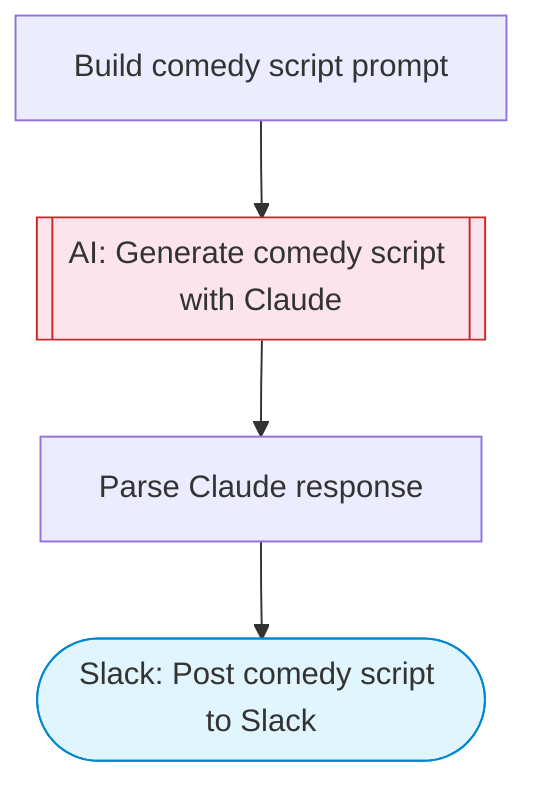

# Comedy Script Generator

Generate comedy video scripts using Claude AI and post them to Slack. Provide a topic or trending theme, and the AI writes a punchy, ready-to-film comedy script with scene directions, dialogue, and timing notes.

> **Works with any AI agent.** Paste this page's URL into Claude Code, Codex, Cursor, Windsurf, OpenClaw, or any coding agent — it will read the docs, connect your platforms, and run this flow for you.

## Quick Start

```bash
# 1. Connect your platforms (one-time setup)
one add slack

# 2. Run the flow
one flow execute n8n-10212-comedy-script-generator \
  --input slackChannel="C01ABC123" \
  --input topic="your topic here" \
  --input style="..." \
  --input duration="..."
```

## Platforms

| Platform | Used for |
|----------|----------|
| Slack | Post comedy script to Slack |

> Don't have these connected yet? Run `one list` to check, then `one add <platform>` to connect.

## What it does

1. Build comedy script prompt
2. Generate comedy script with Claude
3. Parse Claude response
4. Post comedy script to Slack

## Flow diagram



## Inputs

| Input | Required | Description |
|-------|----------|-------------|
| `slackChannel` | Yes | Slack channel ID to post the comedy script |
| `topic` | Yes | Comedy topic or theme (e.g. 'working from home fails', 'first date disasters') |
| `style` | No | Script style: short-form sketch, standup bit, sitcom scene, or TikTok skit (default: short-form sketch) |
| `duration` | No | Target video duration (e.g. '30 seconds', '60 seconds', '2 minutes') (default: 60 seconds) |

---

<sub>Based on [n8n #10212](https://n8n.io/workflows/10212) · 35.9K views on n8n · by [n3witalia](https://n8n.io/creators/n3witalia) · Converted to One CLI on 2026-03-25</sub>
