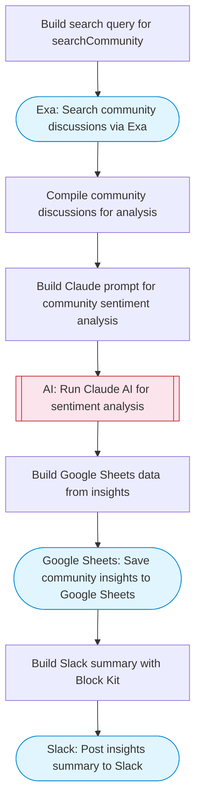

# Community insights: search, analyze sentiment, save to Sheets

Searches community discussions via Exa, uses Claude AI to analyze sentiment, identify themes, and extract key insights from community conversations, then saves the structured analysis to Google Sheets.

> **Works with any AI agent.** Paste this page's URL into Claude Code, Codex, Cursor, Windsurf, OpenClaw, or any coding agent — it will read the docs, connect your platforms, and run this flow for you.

## Quick Start

```bash
# 1. Connect your platforms (one-time setup)
one add exa
one add google-sheets
one add slack

# 2. Run the flow
one flow execute n8n-2374-community-insights-qdrant \
  --input slackChannel="C01ABC123" \
  --input topic="your topic here" \
  --input communitySource="..." \
  --input maxDiscussions="10"
```

## Platforms

| Platform | Used for |
|----------|----------|
| Exa | Community discussion search |
| Google Sheets | Saving insights |
| Slack | Posting summary |

> Don't have these connected yet? Run `one list` to check, then `one add <platform>` to connect.

## What it does

1. Build search query for searchCommunity
2. Search community discussions via Exa
3. Compile community discussions for analysis
4. Build Claude prompt for community sentiment analysis
5. Run Claude AI for sentiment analysis
6. Save community insights to Google Sheets
7. Post insights summary to Slack

## Flow diagram



## Inputs

| Input | Required | Description |
|-------|----------|-------------|
| `slackChannel` | Yes | Slack channel for insights summary |
| `topic` | Yes | Topic to analyze community discussions about (e.g. 'AI code assistants', 'remote work tools', 'electric vehicles') |
| `communitySource` | No | Community sources to focus on (e.g. 'Reddit', 'Hacker News', 'Stack Overflow') (default: Reddit, Hacker News, forums) |
| `maxDiscussions` | No | Maximum number of discussions to analyze (default: 15) |

---

<sub>Based on [n8n #2374](https://n8n.io/workflows/2374) · 56.1K views on n8n · by [jimleuk](https://n8n.io/creators/jimleuk) · Converted to One CLI on 2026-03-25</sub>
