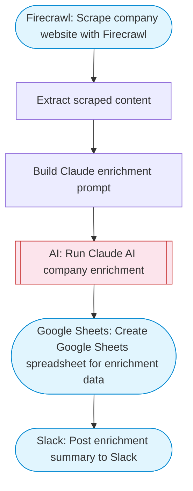

# Company enrichment from website content

Scrapes a company website with Firecrawl, uses Claude AI to extract structured data (market, industry, target audience, value proposition), and saves the enrichment results to Google Sheets.

> **Works with any AI agent.** Paste this page's URL into Claude Code, Codex, Cursor, Windsurf, OpenClaw, or any coding agent — it will read the docs, connect your platforms, and run this flow for you.

## Quick Start

```bash
# 1. Connect your platforms (one-time setup)
one add firecrawl
one add google-sheets
one add slack

# 2. Run the flow
one flow execute n8n-1847-company-enrichment \
  --input slackChannel="C01ABC123" \
  --input companyUrl="https://example.com" \
  --input companyName="..." \
  --input spreadsheetName="..."
```

## Platforms

| Platform | Used for |
|----------|----------|
| Firecrawl | Web scraping |
| Google Sheets | Saving data |
| Slack | Status notification |

> Don't have these connected yet? Run `one list` to check, then `one add <platform>` to connect.

## What it does

1. Scrape company website with Firecrawl
2. Extract scraped content
3. Build Claude enrichment prompt
4. Run Claude AI company enrichment
5. Create Google Sheets spreadsheet for enrichment data
6. Post enrichment summary to Slack

## Flow diagram



## Inputs

| Input | Required | Description |
|-------|----------|-------------|
| `slackChannel` | Yes | Slack channel for enrichment status updates |
| `companyUrl` | Yes | Company website URL to scrape and enrich (e.g. 'https://example.com') |
| `companyName` | No | Company name (if known, otherwise extracted from website) (default: ) |
| `spreadsheetName` | No | Name for the Google Sheets spreadsheet (default: Company Enrichment Data) |

---

<sub>Based on [n8n #1847](https://n8n.io/workflows/1862) · 90.4K views on n8n · Converted to One CLI on 2026-03-25</sub>
