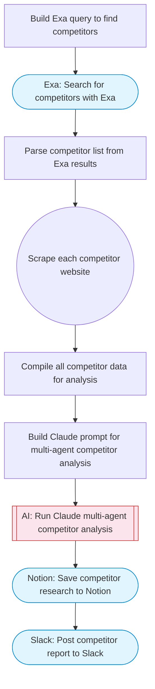

# Automate competitor research with Exa AI, Notion and multi-agent analysis

Searches for competitors of a given company using Exa web search, scrapes each competitor website with Firecrawl, runs multi-agent AI analysis for company overview, product offerings, and reviews, then saves structured profiles to Notion and reports to Slack.

> **Works with any AI agent.** Paste this page's URL into Claude Code, Codex, Cursor, Windsurf, OpenClaw, or any coding agent — it will read the docs, connect your platforms, and run this flow for you.

## Quick Start

```bash
# 1. Connect your platforms (one-time setup)
one add exa
one add firecrawl
one add notion
one add slack

# 2. Run the flow
one flow execute n8n-2354-competitor-research \
  --input sourceCompany="..." \
  --input sourceCompanyUrl="https://example.com" \
  --input notionParentPageId="..." \
  --input slackChannel="C01ABC123" \
  --input maxCompetitors="10"
```

## Platforms

| Platform | Used for |
|----------|----------|
| Exa | Competitor search |
| Firecrawl | Scraping competitor websites |
| Notion | Saving competitor profiles |
| Slack | Report delivery |

> Don't have these connected yet? Run `one list` to check, then `one add <platform>` to connect.

## What it does

1. Build Exa query to find competitors
2. Search for competitors with Exa
3. Parse competitor list from Exa results
4. Scrape each competitor website
5. Compile all competitor data for analysis
6. Build Claude prompt for multi-agent competitor analysis
7. Run Claude multi-agent competitor analysis
8. Save competitor research to Notion
9. Post competitor report to Slack

## Flow diagram



## Inputs

| Input | Required | Description |
|-------|----------|-------------|
| `sourceCompany` | Yes | Company name to find competitors for (e.g. 'Stripe') |
| `sourceCompanyUrl` | No | Company website URL (optional, helps with better search) (default: ) |
| `notionParentPageId` | Yes | Notion parent page ID to store competitor profiles |
| `slackChannel` | Yes | Slack channel for competitor research report |
| `maxCompetitors` | No | Maximum number of competitors to analyze (default: 5) |

---

<sub>Based on [n8n #2354](https://n8n.io/workflows/2354) · 28.5K views on n8n · by [jimleuk](https://n8n.io/creators/jimleuk) · Converted to One CLI on 2026-03-25</sub>
