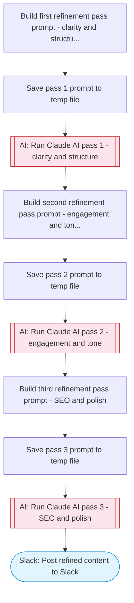

# Iterative content refinement with AI multi-pass

Takes draft content, uses Claude AI in multiple refinement passes to iteratively improve clarity, engagement, SEO, and tone, then posts the polished final version to Slack with before/after comparison. Adapted from n8n's GPT-4 multi-agent content refinement workflow.

> **Works with any AI agent.** Paste this page's URL into Claude Code, Codex, Cursor, Windsurf, OpenClaw, or any coding agent — it will read the docs, connect your platforms, and run this flow for you.

## Quick Start

```bash
# 1. Connect your platforms (one-time setup)
one add slack

# 2. Run the flow
one flow execute n8n-195-content-refinement \
  --input slackChannel="C01ABC123" \
  --input draftContent="..." \
  --input contentType="..." \
  --input targetAudience="..." \
  --input refinementPasses="..."
```

## Platforms

| Platform | Used for |
|----------|----------|
| Slack | Posting refined content |

> Don't have these connected yet? Run `one list` to check, then `one add <platform>` to connect.

## What it does

1. Build first refinement pass prompt (clarity and structure)
2. Save pass 1 prompt to temp file
3. Run Claude AI pass 1 (clarity and structure)
4. Build second refinement pass prompt (engagement and tone)
5. Save pass 2 prompt to temp file
6. Run Claude AI pass 2 (engagement and tone)
7. Build third refinement pass prompt (SEO and polish)
8. Save pass 3 prompt to temp file
9. Run Claude AI pass 3 (SEO and polish)
10. Post refined content to Slack

## Flow diagram



## Inputs

| Input | Required | Description |
|-------|----------|-------------|
| `slackChannel` | Yes | Slack channel ID to post the refined content |
| `draftContent` | Yes | The draft content to refine (article, blog post, email, etc.) |
| `contentType` | No | Type of content: blog post, article, email, social media, landing page (default: blog post) |
| `targetAudience` | No | Target audience description for tone and style calibration (default: general professional audience) |
| `refinementPasses` | No | Number of refinement passes (default: 3, max: 5) (default: 3) |

---

<sub>Based on [n8n #195](https://n8n.io/workflows/195) · 31.5K views on n8n · Converted to One CLI on 2026-03-25</sub>
