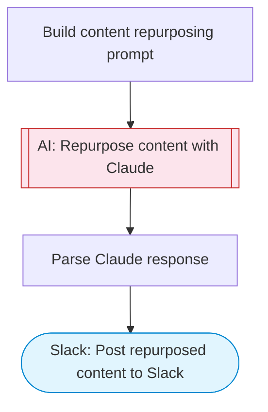

# Multi-Format Content Repurposer

Take one piece of content and use Claude AI to adapt it for multiple social media formats (Twitter thread, LinkedIn post, Instagram caption, blog excerpt, email newsletter). Posts the repurposed content bundle to Slack.

> **Works with any AI agent.** Paste this page's URL into Claude Code, Codex, Cursor, Windsurf, OpenClaw, or any coding agent — it will read the docs, connect your platforms, and run this flow for you.

## Quick Start

```bash
# 1. Connect your platforms (one-time setup)
one add slack

# 2. Run the flow
one flow execute n8n-3669-content-repurposer \
  --input slackChannel="C01ABC123" \
  --input originalContent="..." \
  --input contentTitle="..." \
  --input targetPlatforms="..." \
  --input brandVoice="..."
```

## Platforms

| Platform | Used for |
|----------|----------|
| Slack | Post repurposed content to Slack |

> Don't have these connected yet? Run `one list` to check, then `one add <platform>` to connect.

## What it does

1. Build content repurposing prompt
2. Repurpose content with Claude
3. Parse Claude response
4. Post repurposed content to Slack

## Flow diagram



## Inputs

| Input | Required | Description |
|-------|----------|-------------|
| `slackChannel` | Yes | Slack channel ID to post the repurposed content |
| `originalContent` | Yes | The original content to repurpose (blog post, article, notes, etc.) |
| `contentTitle` | No | Title of the original content (default: ) |
| `targetPlatforms` | No | Comma-separated target platforms (default: twitter,linkedin,instagram,blog,email) |
| `brandVoice` | No | Brand voice or tone guidelines (default: professional yet approachable) |

---

<sub>Based on [n8n #3669](https://n8n.io/workflows/3669) · 32.7K views on n8n · by [n3witalia](https://n8n.io/creators/n3witalia) · Converted to One CLI on 2026-03-25</sub>
