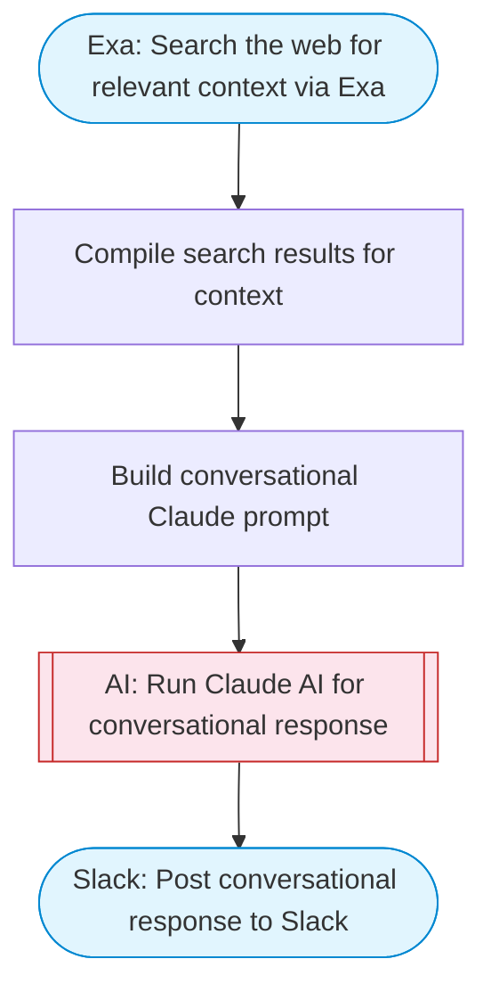

# Conversational AI agent with web search

A multi-turn conversational AI agent. Takes a user question, performs Exa web search for real-time context, uses Claude to generate a thoughtful conversational response, and delivers the answer to Slack with Block Kit formatting.

> **Works with any AI agent.** Paste this page's URL into Claude Code, Codex, Cursor, Windsurf, OpenClaw, or any coding agent — it will read the docs, connect your platforms, and run this flow for you.

## Quick Start

```bash
# 1. Connect your platforms (one-time setup)
one add exa
one add slack

# 2. Run the flow
one flow execute n8n-1963-conversational-agent-custom \
  --input question="your question here" \
  --input conversationHistory="..." \
  --input slackChannel="C01ABC123" \
  --input personality="..."
```

## Platforms

| Platform | Used for |
|----------|----------|
| Exa | Web search |
| Slack | Posting the response |

> Don't have these connected yet? Run `one list` to check, then `one add <platform>` to connect.

## What it does

1. Search the web for relevant context via Exa
2. Compile search results for context
3. Build conversational Claude prompt
4. Run Claude AI for conversational response
5. Post conversational response to Slack

## Flow diagram



## Inputs

| Input | Required | Description |
|-------|----------|-------------|
| `question` | Yes | The user's conversational question |
| `conversationHistory` | No | Previous conversation context (optional, for multi-turn conversations) (default: ) |
| `slackChannel` | Yes | Slack channel ID for the conversation |
| `personality` | No | Agent personality (e.g. 'helpful and friendly', 'technical expert', 'creative writer') (default: helpful and friendly) |

---

<sub>Based on [n8n #1963](https://n8n.io/workflows/1963) · 54.8K views on n8n · by [n8n-team](https://n8n.io/creators/n8n-team) · Converted to One CLI on 2026-03-25</sub>
