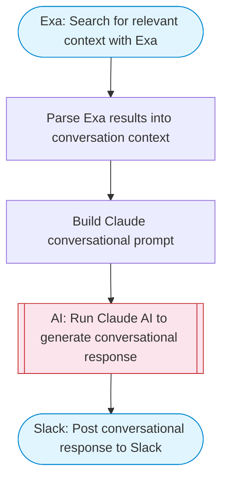

# Conversational AI — Question + Exa Research + Claude Answer to Slack

Takes a conversational question, enriches it with Exa web search for real-time context, uses Claude AI to generate a well-researched conversational response, and posts it to Slack with Block Kit formatting.

> **Works with any AI agent.** Paste this page's URL into Claude Code, Codex, Cursor, Windsurf, OpenClaw, or any coding agent — it will read the docs, connect your platforms, and run this flow for you.

## Quick Start

```bash
# 1. Connect your platforms (one-time setup)
one add exa
one add slack

# 2. Run the flow
one flow execute n8n-2405-conversational-ai \
  --input slackChannel="C01ABC123" \
  --input question="your question here" \
  --input conversationStyle="..."
```

## Platforms

| Platform | Used for |
|----------|----------|
| Exa | Web research |
| Slack | Post conversational response to Slack |

> Don't have these connected yet? Run `one list` to check, then `one add <platform>` to connect.

## What it does

1. Search for relevant context with Exa
2. Parse Exa results into conversation context
3. Build Claude conversational prompt
4. Run Claude AI to generate conversational response
5. Post conversational response to Slack

## Flow diagram



## Inputs

| Input | Required | Description |
|-------|----------|-------------|
| `slackChannel` | Yes | Slack channel ID to post the response |
| `question` | Yes | Conversational question or topic to discuss |
| `conversationStyle` | No | Conversation style (e.g. casual, academic, witty) (default: friendly and informative) |

---

<sub>Based on [n8n #2405](https://n8n.io/workflows/2405) · 40.2K views on n8n · by [ayoub-n8n](https://n8n.io/creators/ayoub-n8n) · Converted to One CLI on 2026-03-25</sub>
