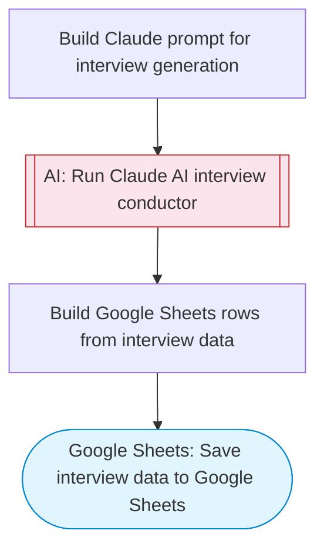

# AI conversational interview conductor

Claude AI conducts a structured multi-question interview on a given topic, collects and evaluates responses, generates follow-up questions, and saves the full interview transcript with analysis to Google Sheets. Adapted from n8n's conversational interview with AI agents workflow.

> **Works with any AI agent.** Paste this page's URL into Claude Code, Codex, Cursor, Windsurf, OpenClaw, or any coding agent — it will read the docs, connect your platforms, and run this flow for you.

## Quick Start

```bash
# 1. Connect your platforms (one-time setup)
one add google-sheets

# 2. Run the flow
one flow execute n8n-197-conversational-interviews \
  --input spreadsheetId="..." \
  --input sheetName="..." \
  --input interviewTopic="your topic here" \
  --input intervieweeName="..." \
  --input numberOfQuestions="your question here" \
  --input intervieweeResponses="..."
```

## Platforms

| Platform | Used for |
|----------|----------|
| Google Sheets | Saving interview data |

> Don't have these connected yet? Run `one list` to check, then `one add <platform>` to connect.

## What it does

1. Build Claude prompt for interview generation
2. Run Claude AI interview conductor
3. Save interview data to Google Sheets

## Flow diagram



## Inputs

| Input | Required | Description |
|-------|----------|-------------|
| `spreadsheetId` | Yes | Google Sheets spreadsheet ID to save interview results |
| `sheetName` | No | Sheet tab name for interview data (default: Interviews) |
| `interviewTopic` | Yes | The topic or role for the interview (e.g., 'Senior Software Engineer', 'Product Manager candidate') |
| `intervieweeName` | Yes | Name of the person being interviewed |
| `numberOfQuestions` | No | Number of interview questions to generate (default: 5) (default: 5) |
| `intervieweeResponses` | Yes | The interviewee's responses to be evaluated, or 'generate-sample' for demo mode |

---

<sub>Based on [n8n #197](https://n8n.io/workflows/197) · 31.2K views on n8n · Converted to One CLI on 2026-03-25</sub>
