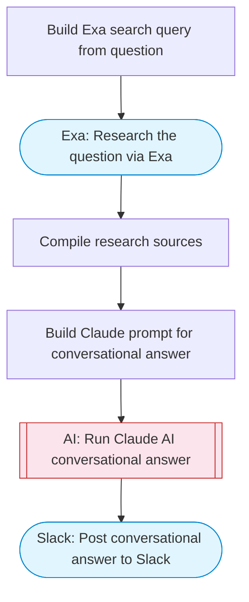

# Conversational Q&A Agent with Web Research

Takes a user question with optional image context, researches the topic via Exa web search, uses Claude AI to generate a comprehensive conversational answer, and posts the response to Slack with source citations. Adapted from n8n's Conversational AI Chatbot with Google Gemini for text and image.

> **Works with any AI agent.** Paste this page's URL into Claude Code, Codex, Cursor, Windsurf, OpenClaw, or any coding agent — it will read the docs, connect your platforms, and run this flow for you.

## Quick Start

```bash
# 1. Connect your platforms (one-time setup)
one add exa
one add slack

# 2. Run the flow
one flow execute n8n-4365-conversational-qa-agent \
  --input question="your question here" \
  --input slackChannel="C01ABC123" \
  --input conversationContext="..." \
  --input responseStyle="..." \
  --input language="..."
```

## Platforms

| Platform | Used for |
|----------|----------|
| Exa | Web research |
| Slack | Posting the answer |

> Don't have these connected yet? Run `one list` to check, then `one add <platform>` to connect.

## What it does

1. Build Exa search query from question
2. Research the question via Exa
3. Compile research sources
4. Build Claude prompt for conversational answer
5. Run Claude AI conversational answer
6. Post conversational answer to Slack

## Flow diagram



## Inputs

| Input | Required | Description |
|-------|----------|-------------|
| `question` | Yes | The user's question to research and answer |
| `slackChannel` | Yes | Slack channel ID to post the answer |
| `conversationContext` | No | Previous conversation context or follow-up information (default: ) |
| `responseStyle` | No | Response style: conversational, technical, brief, detailed (default: conversational) |
| `language` | No | Response language (default: English) |

---

<sub>Based on [n8n #4365](https://n8n.io/workflows/4365) · 20.7K views on n8n · by [thecrawlerzero](https://n8n.io/creators/thecrawlerzero) · Converted to One CLI on 2026-03-25</sub>
