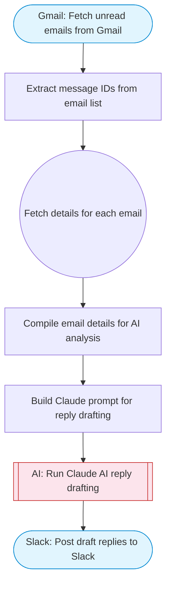

# AI Customer Inbox Responder

Fetches recent unread emails from Gmail, uses Claude AI to analyze each message and draft contextually appropriate reply suggestions, and posts the drafted replies to Slack for human review. Adapted from n8n's Instagram DM agent workflow.

> **Works with any AI agent.** Paste this page's URL into Claude Code, Codex, Cursor, Windsurf, OpenClaw, or any coding agent — it will read the docs, connect your platforms, and run this flow for you.

## Quick Start

```bash
# 1. Connect your platforms (one-time setup)
one add gmail
one add slack

# 2. Run the flow
one flow execute n8n-2718-customer-inbox-responder \
  --input slackChannel="C01ABC123" \
  --input maxEmails="user@example.com" \
  --input replyTone="..." \
  --input companyContext="..."
```

## Platforms

| Platform | Used for |
|----------|----------|
| Gmail | Reading inbox |
| Slack | Posting draft replies |

> Don't have these connected yet? Run `one list` to check, then `one add <platform>` to connect.

## What it does

1. Fetch unread emails from Gmail
2. Extract message IDs from email list
3. Fetch details for each email
4. Compile email details for AI analysis
5. Build Claude prompt for reply drafting
6. Run Claude AI reply drafting
7. Post draft replies to Slack

## Flow diagram



## Inputs

| Input | Required | Description |
|-------|----------|-------------|
| `slackChannel` | Yes | Slack channel ID to post the draft replies for review |
| `maxEmails` | No | Maximum number of unread emails to process (default: 10) (default: 10) |
| `replyTone` | No | Tone for draft replies (e.g. professional, casual, formal) (default: professional and friendly) |
| `companyContext` | No | Brief company/product context for more relevant replies (default: ) |

---

<sub>Based on [n8n #2718](https://n8n.io/workflows/2718) · 47.1K views on n8n · by [alex-nocode](https://n8n.io/creators/alex-nocode) · Converted to One CLI on 2026-03-25</sub>
