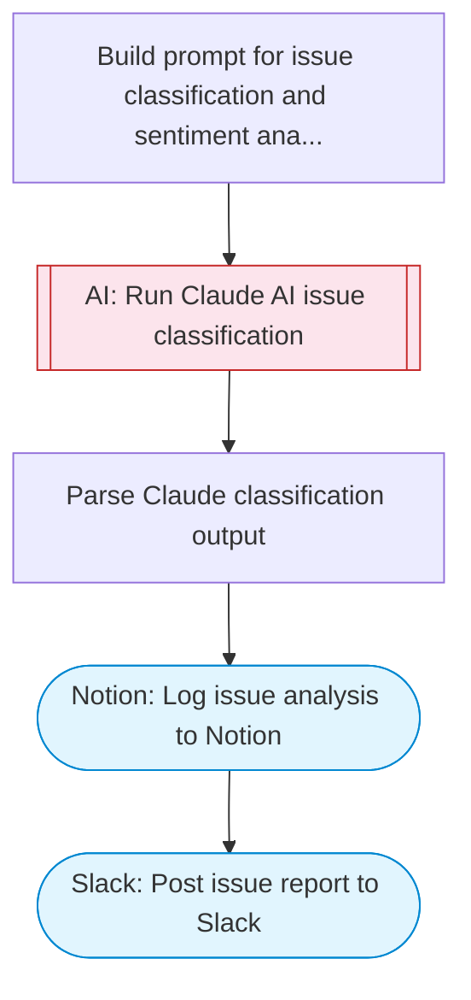

# AI-powered customer support issue resolution with Slack and Notion

Analyzes customer support issues using AI text classification and sentiment analysis, searches a Notion knowledge base for solutions, categorizes issues by priority, and posts resolution reports and escalation alerts to Slack.

> **Works with any AI agent.** Paste this page's URL into Claude Code, Codex, Cursor, Windsurf, OpenClaw, or any coding agent — it will read the docs, connect your platforms, and run this flow for you.

## Quick Start

```bash
# 1. Connect your platforms (one-time setup)
one add slack
one add notion

# 2. Run the flow
one flow execute n8n-2468-customer-support-resolution \
  --input slackChannel="C01ABC123" \
  --input escalationChannel="C01ABC123" \
  --input notionParentPageId="..." \
  --input issueTitle="..." \
  --input issueDescription="..." \
  --input customerName="..." \
  --input issueHistory="..."
```

## Platforms

| Platform | Used for |
|----------|----------|
| Slack | Notifications and escalation |
| Notion | Knowledge base lookup |

> Don't have these connected yet? Run `one list` to check, then `one add <platform>` to connect.

## What it does

1. Build prompt for issue classification and sentiment analysis
2. Run Claude AI issue classification
3. Parse Claude classification output
4. Log issue analysis to Notion
5. Post issue report to Slack

## Flow diagram



## Inputs

| Input | Required | Description |
|-------|----------|-------------|
| `slackChannel` | Yes | Slack channel for support issue reports |
| `escalationChannel` | No | Slack channel for escalation alerts (defaults to main channel if empty) (default: ) |
| `notionParentPageId` | Yes | Notion parent page ID for the knowledge base |
| `issueTitle` | Yes | Customer support issue title |
| `issueDescription` | Yes | Full description of the customer support issue |
| `customerName` | No | Customer name or ID (default: Customer) |
| `issueHistory` | No | Previous conversation thread or issue history (default: ) |

---

<sub>Based on [n8n #2468](https://n8n.io/workflows/2468) · 28.3K views on n8n · by [jimleuk](https://n8n.io/creators/jimleuk) · Converted to One CLI on 2026-03-25</sub>
