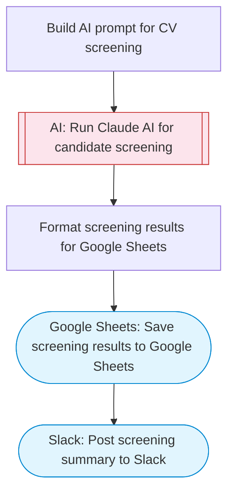

# AI-powered CV screening and candidate analysis

Reads job application data from Google Sheets, uses Claude AI to screen and score each candidate against job requirements, and updates the spreadsheet with AI analysis results including scores, recommendations, and detailed feedback.

> **Works with any AI agent.** Paste this page's URL into Claude Code, Codex, Cursor, Windsurf, OpenClaw, or any coding agent — it will read the docs, connect your platforms, and run this flow for you.

## Quick Start

```bash
# 1. Connect your platforms (one-time setup)
one add google-sheets
one add slack

# 2. Run the flow
one flow execute n8n-7456-cv-screening-ai \
  --input slackChannel="C01ABC123" \
  --input jobTitle="..." \
  --input jobDescription="..." \
  --input candidateData="..."
```

## Platforms

| Platform | Used for |
|----------|----------|
| Google Sheets | Reading applications and saving results |
| Slack | Posting screening summary |

> Don't have these connected yet? Run `one list` to check, then `one add <platform>` to connect.

## What it does

1. Build AI prompt for CV screening
2. Run Claude AI for candidate screening
3. Format screening results for Google Sheets
4. Save screening results to Google Sheets
5. Post screening summary to Slack

## Flow diagram



## Inputs

| Input | Required | Description |
|-------|----------|-------------|
| `slackChannel` | Yes | Slack channel ID for screening results |
| `jobTitle` | Yes | Job title being hired for (e.g. 'Senior Frontend Engineer') |
| `jobDescription` | Yes | Full job description with requirements, qualifications, and responsibilities |
| `candidateData` | Yes | Candidate information (name, email, CV summary, skills, experience) as text or JSON |

---

<sub>Based on [n8n #7456](https://n8n.io/workflows/7456) · 24.2K views on n8n · by [lucaspeyrin](https://n8n.io/creators/lucaspeyrin) · Converted to One CLI on 2026-03-25</sub>
