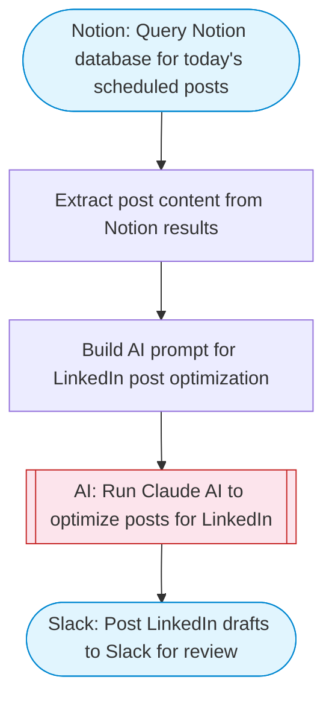

# Daily LinkedIn post publisher from Notion

Fetches scheduled social media posts from a Notion database, uses Claude AI to polish and format the content for LinkedIn, and posts a ready-to-publish draft to Slack for review.

> **Works with any AI agent.** Paste this page's URL into Claude Code, Codex, Cursor, Windsurf, OpenClaw, or any coding agent — it will read the docs, connect your platforms, and run this flow for you.

## Quick Start

```bash
# 1. Connect your platforms (one-time setup)
one add notion
one add slack

# 2. Run the flow
one flow execute n8n-2273-daily-linkedin-posts-notion \
  --input slackChannel="C01ABC123" \
  --input notionDatabaseId="..."
```

## Platforms

| Platform | Used for |
|----------|----------|
| Notion | Reading the content database |
| Slack | Posting the linkedin-ready draft |

> Don't have these connected yet? Run `one list` to check, then `one add <platform>` to connect.

## What it does

1. Query Notion database for today's scheduled posts
2. Extract post content from Notion results
3. Build AI prompt for LinkedIn post optimization
4. Run Claude AI to optimize posts for LinkedIn
5. Post LinkedIn drafts to Slack for review

## Flow diagram



## Inputs

| Input | Required | Description |
|-------|----------|-------------|
| `slackChannel` | Yes | Slack channel ID to post the LinkedIn draft |
| `notionDatabaseId` | Yes | Notion database ID containing social media posts (must have Title, Content, Status, and ScheduledDate properties) |

---

<sub>Based on [n8n #2273](https://n8n.io/workflows/2273) · 25.5K views on n8n · by [matheusweck](https://n8n.io/creators/matheusweck) · Converted to One CLI on 2026-03-25</sub>
