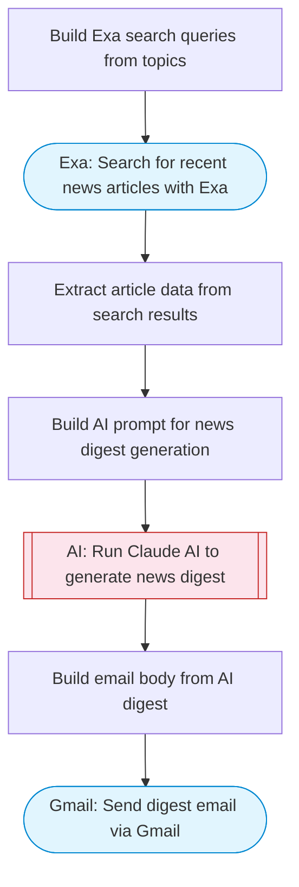

# Daily news digest from web sources via email

Searches the web for news on specified topics using Exa, uses Claude AI to summarize articles into a concise daily digest, and delivers it via Gmail.

> **Works with any AI agent.** Paste this page's URL into Claude Code, Codex, Cursor, Windsurf, OpenClaw, or any coding agent — it will read the docs, connect your platforms, and run this flow for you.

## Quick Start

```bash
# 1. Connect your platforms (one-time setup)
one add exa
one add gmail

# 2. Run the flow
one flow execute n8n-4709-daily-news-digest-email \
  --input recipientEmail="user@example.com" \
  --input topics="your topic here" \
  --input maxArticles="10"
```

## Platforms

| Platform | Used for |
|----------|----------|
| Exa | Searching news articles |
| Gmail | Sending the digest email |

> Don't have these connected yet? Run `one list` to check, then `one add <platform>` to connect.

## What it does

1. Build Exa search queries from topics
2. Search for recent news articles with Exa
3. Extract article data from search results
4. Build AI prompt for news digest generation
5. Run Claude AI to generate news digest
6. Build email body from AI digest
7. Send digest email via Gmail

## Flow diagram



## Inputs

| Input | Required | Description |
|-------|----------|-------------|
| `recipientEmail` | Yes | Email address to send the daily digest to |
| `topics` | Yes | Comma-separated news topics (e.g. 'AI, startups, climate tech') |
| `maxArticles` | No | Maximum number of articles to include (default 10) (default: 10) |

---

<sub>Based on [n8n #4709](https://n8n.io/workflows/4709) · 25.1K views on n8n · by [daniellegomes](https://n8n.io/creators/daniellegomes) · Converted to One CLI on 2026-03-25</sub>
