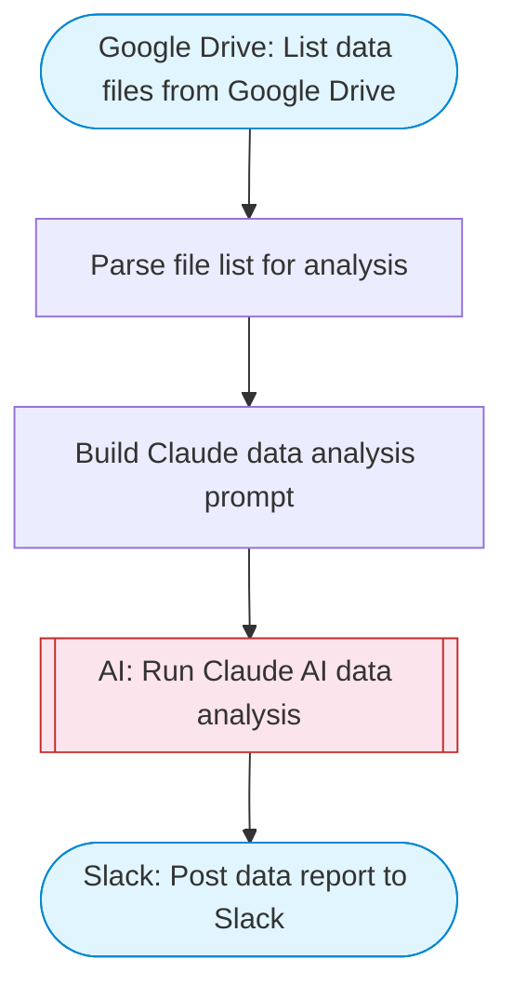

# Data File Processor — Fetch, Transform, and Report to Slack

Fetches data files from Google Drive, uses Claude AI to analyze and transform the data (summarize, clean, restructure), and posts a structured report to Slack with Block Kit formatting.

> **Works with any AI agent.** Paste this page's URL into Claude Code, Codex, Cursor, Windsurf, OpenClaw, or any coding agent — it will read the docs, connect your platforms, and run this flow for you.

## Quick Start

```bash
# 1. Connect your platforms (one-time setup)
one add google-drive
one add slack

# 2. Run the flow
one flow execute n8n-1826-data-file-processor \
  --input slackChannel="C01ABC123" \
  --input driveQuery="your question here" \
  --input maxFiles="10" \
  --input transformGoal="..."
```

## Platforms

| Platform | Used for |
|----------|----------|
| Google Drive | Connection key |
| Slack | Post data report to Slack |

> Don't have these connected yet? Run `one list` to check, then `one add <platform>` to connect.

## What it does

1. List data files from Google Drive
2. Parse file list for analysis
3. Build Claude data analysis prompt
4. Run Claude AI data analysis
5. Post data report to Slack

## Flow diagram



## Inputs

| Input | Required | Description |
|-------|----------|-------------|
| `slackChannel` | Yes | Slack channel ID to post the data report |
| `driveQuery` | No | Google Drive query to find data files (default: mimeType = 'application/vnd.google-apps.spreadsheet' or mimeType contains 'spreadsheet' or mimeType contains 'excel') |
| `maxFiles` | No | Maximum number of files to process (default: 3) |
| `transformGoal` | No | What transformation or analysis to perform on the data (default: Summarize the data, identify trends, highlight anomalies, and provide key statistics) |

---

<sub>Based on [n8n #1826](https://n8n.io/workflows/1826) · 39.2K views on n8n · by [n8n-team](https://n8n.io/creators/n8n-team) · Converted to One CLI on 2026-03-25</sub>
