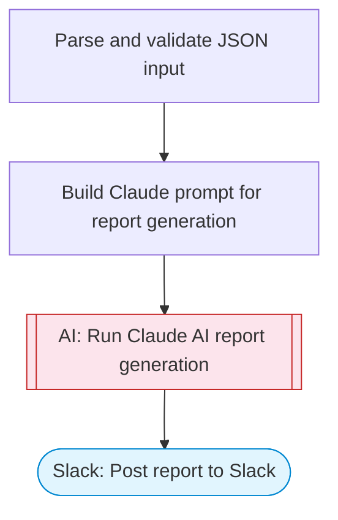

# AI Data Report Formatter

Takes JSON data input, uses Claude AI to analyze, format, and transform it into a structured business report, and posts the formatted report to Slack with Block Kit formatting. Adapted from n8n's JSON-to-Excel file converter workflow.

> **Works with any AI agent.** Paste this page's URL into Claude Code, Codex, Cursor, Windsurf, OpenClaw, or any coding agent — it will read the docs, connect your platforms, and run this flow for you.

## Quick Start

```bash
# 1. Connect your platforms (one-time setup)
one add slack

# 2. Run the flow
one flow execute n8n-1435-data-report-formatter \
  --input slackChannel="C01ABC123" \
  --input jsonData="..." \
  --input reportTitle="..." \
  --input reportType="..."
```

## Platforms

| Platform | Used for |
|----------|----------|
| Slack | Posting the report |

> Don't have these connected yet? Run `one list` to check, then `one add <platform>` to connect.

## What it does

1. Parse and validate JSON input
2. Build Claude prompt for report generation
3. Run Claude AI report generation
4. Post report to Slack

## Flow diagram



## Inputs

| Input | Required | Description |
|-------|----------|-------------|
| `slackChannel` | Yes | Slack channel ID to post the formatted report |
| `jsonData` | Yes | JSON data to format into a report (stringified JSON array or object) |
| `reportTitle` | No | Title for the formatted report (default: Data Report) |
| `reportType` | No | Report type: summary, detailed, executive, comparison (default: summary) |

---

<sub>Based on [n8n #1435](https://n8n.io/workflows/1435) · 46.0K views on n8n · by [dickhoning](https://n8n.io/creators/dickhoning) · Converted to One CLI on 2026-03-25</sub>
