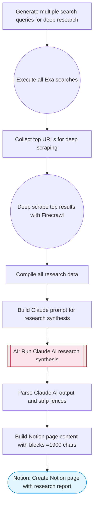

# AI Deep Research Agent

Performs multi-query Exa search for comprehensive research, deep scrapes top results with Firecrawl, Claude AI synthesizes a structured research report with executive summary, key findings, and data points, then saves the report to Notion with content split into blocks of 1900 characters or fewer.

> **Works with any AI agent.** Paste this page's URL into Claude Code, Codex, Cursor, Windsurf, OpenClaw, or any coding agent — it will read the docs, connect your platforms, and run this flow for you.

## Quick Start

```bash
# 1. Connect your platforms (one-time setup)
one add exa
one add firecrawl
one add notion

# 2. Run the flow
one flow execute n8n-2878-deep-research-agent \
  --input notionParentPageId="..." \
  --input researchTopic="your topic here" \
  --input depth="..."
```

## Platforms

| Platform | Used for |
|----------|----------|
| Exa | Web search |
| Firecrawl | Deep scraping |
| Notion | Saving research report |

> Don't have these connected yet? Run `one list` to check, then `one add <platform>` to connect.

## What it does

1. Generate multiple search queries for deep research
2. Execute all Exa searches
3. Collect top URLs for deep scraping
4. Deep scrape top results with Firecrawl
5. Compile all research data
6. Build Claude prompt for research synthesis
7. Run Claude AI research synthesis
8. Parse Claude AI output and strip fences
9. Build Notion page content with blocks <=1900 chars
10. Create Notion page with research report

## Flow diagram



## Inputs

| Input | Required | Description |
|-------|----------|-------------|
| `notionParentPageId` | Yes | Notion parent page ID where the research report will be created |
| `researchTopic` | Yes | Research topic or question (e.g. 'State of AI agents in enterprise 2025') |
| `depth` | No | Research depth: 'quick' (3 queries), 'standard' (5 queries), 'comprehensive' (8 queries) (default: comprehensive) |

---

<sub>Based on [n8n #2878](https://n8n.io/workflows/2878) · 76.6K views on n8n · by [jimleuk](https://n8n.io/creators/jimleuk) · Converted to One CLI on 2026-03-25</sub>
