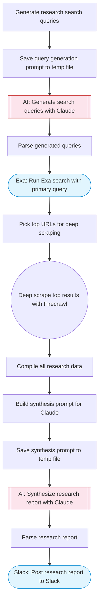

# Deep Research Agent

Run multi-query Exa searches, deep-scrape top results with Firecrawl, and have Claude AI synthesize a comprehensive research report. Posts the final report to Slack.

> **Works with any AI agent.** Paste this page's URL into Claude Code, Codex, Cursor, Windsurf, OpenClaw, or any coding agent — it will read the docs, connect your platforms, and run this flow for you.

## Quick Start

```bash
# 1. Connect your platforms (one-time setup)
one add exa
one add firecrawl
one add slack

# 2. Run the flow
one flow execute n8n-2883-deep-research-agent \
  --input slackChannel="C01ABC123" \
  --input researchTopic="your topic here" \
  --input depth="..."
```

## Platforms

| Platform | Used for |
|----------|----------|
| Exa | Run Exa search with primary query |
| Firecrawl | Web scraping |
| Slack | Post research report to Slack |

> Don't have these connected yet? Run `one list` to check, then `one add <platform>` to connect.

## What it does

1. Generate research search queries
2. Save query generation prompt to temp file
3. Generate search queries with Claude
4. Parse generated queries
5. Run Exa search with primary query
6. Pick top URLs for deep scraping
7. Deep scrape top results with Firecrawl
8. Compile all research data
9. Build synthesis prompt for Claude
10. Save synthesis prompt to temp file
11. Synthesize research report with Claude
12. Parse research report
13. Post research report to Slack

## Flow diagram



## Inputs

| Input | Required | Description |
|-------|----------|-------------|
| `slackChannel` | Yes | Slack channel ID to post the research report |
| `researchTopic` | Yes | The research topic or question to investigate |
| `depth` | No | Research depth: 'quick' (3 queries), 'standard' (5 queries), or 'deep' (8 queries) (default: standard) |

---

<sub>Based on [n8n #2883](https://n8n.io/workflows/2883) · 33.0K views on n8n · by [leonardvanhemert](https://n8n.io/creators/leonardvanhemert) · Converted to One CLI on 2026-03-25</sub>
