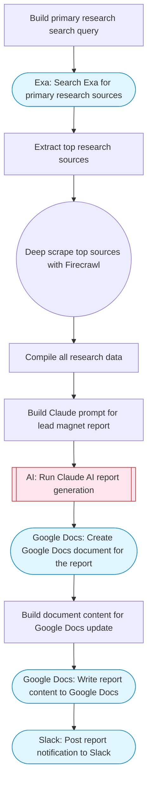

# Deep research sales lead magnet agent

Takes a company or topic, performs deep web research via Exa, scrapes key sources with Firecrawl, uses Claude AI to synthesize a comprehensive lead-magnet research report, and saves it to Google Docs. Adapted from n8n's Deep Research Sales Lead Magnet Agent workflow.

> **Works with any AI agent.** Paste this page's URL into Claude Code, Codex, Cursor, Windsurf, OpenClaw, or any coding agent — it will read the docs, connect your platforms, and run this flow for you.

## Quick Start

```bash
# 1. Connect your platforms (one-time setup)
one add exa
one add firecrawl
one add google-docs
one add slack

# 2. Run the flow
one flow execute n8n-4721-deep-research-sales-lead \
  --input slackChannel="C01ABC123" \
  --input researchTopic="your topic here" \
  --input targetAudience="..." \
  --input reportTitle="..."
```

## Platforms

| Platform | Used for |
|----------|----------|
| Exa | Web research |
| Firecrawl | Deep scraping |
| Google Docs | Saving the report |
| Slack | Notifications |

> Don't have these connected yet? Run `one list` to check, then `one add <platform>` to connect.

## What it does

1. Build primary research search query
2. Search Exa for primary research sources
3. Extract top research sources
4. Deep scrape top sources with Firecrawl
5. Compile all research data
6. Build Claude prompt for lead magnet report
7. Run Claude AI report generation
8. Create Google Docs document for the report
9. Build document content for Google Docs update
10. Write report content to Google Docs
11. Post report notification to Slack

## Flow diagram



## Inputs

| Input | Required | Description |
|-------|----------|-------------|
| `slackChannel` | Yes | Slack channel ID for research updates |
| `researchTopic` | Yes | Topic or company to deeply research (e.g. 'AI in healthcare 2025 trends') |
| `targetAudience` | No | Who the lead magnet report targets (default: C-level executives and decision makers) |
| `reportTitle` | No | Title for the generated report (default: Industry Research Report) |

---

<sub>Based on [n8n #4721](https://n8n.io/workflows/4721) · 29.1K views on n8n · by [maxmitcham](https://n8n.io/creators/maxmitcham) · Converted to One CLI on 2026-03-25</sub>
