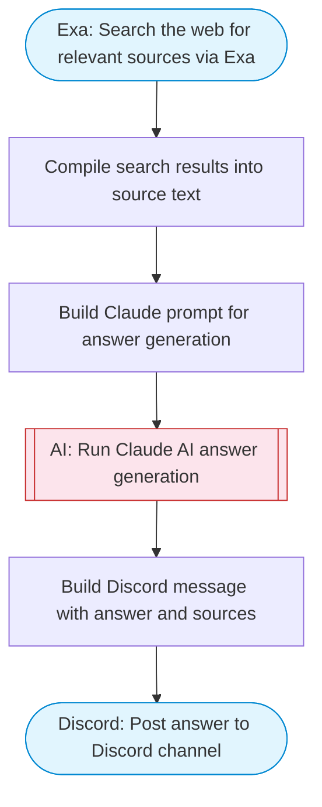

# Discord AI-powered question answering bot

Takes a user question, searches the web via Exa for relevant information, Claude AI synthesizes a comprehensive answer from the sources, then posts the answer to a Discord channel. Adapted from n8n's Discord AI-powered bot workflow.

> **Works with any AI agent.** Paste this page's URL into Claude Code, Codex, Cursor, Windsurf, OpenClaw, or any coding agent — it will read the docs, connect your platforms, and run this flow for you.

## Quick Start

```bash
# 1. Connect your platforms (one-time setup)
one add exa
one add discord

# 2. Run the flow
one flow execute n8n-199-discord-ai-bot \
  --input question="your question here" \
  --input channelId="C01ABC123"
```

## Platforms

| Platform | Used for |
|----------|----------|
| Exa | Web search |
| Discord | Posting messages |

> Don't have these connected yet? Run `one list` to check, then `one add <platform>` to connect.

## What it does

1. Search the web for relevant sources via Exa
2. Compile search results into source text
3. Build Claude prompt for answer generation
4. Run Claude AI answer generation
5. Build Discord message with answer and sources
6. Post answer to Discord channel

## Flow diagram



## Inputs

| Input | Required | Description |
|-------|----------|-------------|
| `question` | Yes | The user question to research and answer |
| `channelId` | Yes | Discord channel ID to post the answer to |

---

<sub>Based on [n8n #199](https://n8n.io/workflows/199) · 30.8K views on n8n · by [vicdorke](https://n8n.io/creators/vicdorke) · Converted to One CLI on 2026-03-25</sub>
