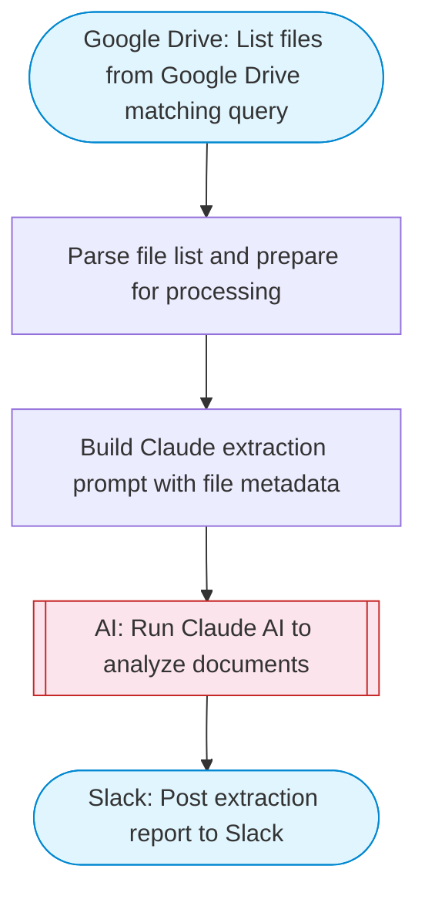

# Doc/Image Parser — Google Drive to Claude OCR to Slack

Fetches files from Google Drive, uses Claude AI to extract text and structured data from documents and images (OCR), then posts the extracted results to Slack with Block Kit formatting.

> **Works with any AI agent.** Paste this page's URL into Claude Code, Codex, Cursor, Windsurf, OpenClaw, or any coding agent — it will read the docs, connect your platforms, and run this flow for you.

## Quick Start

```bash
# 1. Connect your platforms (one-time setup)
one add google-drive
one add slack

# 2. Run the flow
one flow execute n8n-3102-doc-image-parser \
  --input slackChannel="C01ABC123" \
  --input driveQuery="your question here" \
  --input maxFiles="10" \
  --input extractionGoal="..."
```

## Platforms

| Platform | Used for |
|----------|----------|
| Google Drive | Connection key |
| Slack | Post extraction report to Slack |

> Don't have these connected yet? Run `one list` to check, then `one add <platform>` to connect.

## What it does

1. List files from Google Drive matching query
2. Parse file list and prepare for processing
3. Build Claude extraction prompt with file metadata
4. Run Claude AI to analyze documents
5. Post extraction report to Slack

## Flow diagram



## Inputs

| Input | Required | Description |
|-------|----------|-------------|
| `slackChannel` | Yes | Slack channel ID to post extracted data |
| `driveQuery` | No | Google Drive search query to find files (e.g. name contains 'invoice') (default: mimeType contains 'pdf' or mimeType contains 'image') |
| `maxFiles` | No | Maximum number of files to process (default: 5) |
| `extractionGoal` | No | What to extract from the documents/images (default: Extract all text, tables, key data points, and structured information from the document or image) |

---

<sub>Based on [n8n #3102](https://n8n.io/workflows/3102) · 42.4K views on n8n · by [jimleuk](https://n8n.io/creators/jimleuk) · Converted to One CLI on 2026-03-25</sub>
