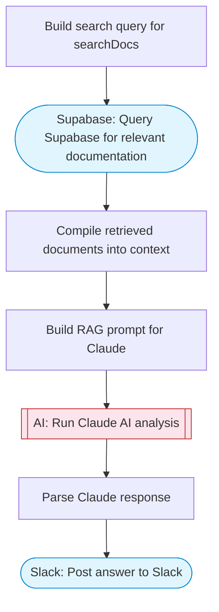

# Documentation Expert Bot

A RAG-powered documentation bot that queries a Supabase knowledge base using Claude AI to provide expert answers, then posts the response to Slack. Ask any question and get context-aware answers from your docs.

> **Works with any AI agent.** Paste this page's URL into Claude Code, Codex, Cursor, Windsurf, OpenClaw, or any coding agent — it will read the docs, connect your platforms, and run this flow for you.

## Quick Start

```bash
# 1. Connect your platforms (one-time setup)
one add supabase
one add slack

# 2. Run the flow
one flow execute n8n-5993-docs-expert-bot \
  --input slackChannel="C01ABC123" \
  --input question="your question here" \
  --input supabaseRef="..." \
  --input tableName="..." \
  --input matchThreshold="..."
```

## Platforms

| Platform | Used for |
|----------|----------|
| Supabase | Query Supabase for relevant documentation |
| Slack | Post answer to Slack |

> Don't have these connected yet? Run `one list` to check, then `one add <platform>` to connect.

## What it does

1. Build search query for searchDocs
2. Query Supabase for relevant documentation
3. Compile retrieved documents into context
4. Build RAG prompt for Claude
5. Run Claude AI analysis
6. Parse Claude response
7. Post answer to Slack

## Flow diagram



## Inputs

| Input | Required | Description |
|-------|----------|-------------|
| `slackChannel` | Yes | Slack channel ID to post the answer |
| `question` | Yes | The question to ask the documentation bot |
| `supabaseRef` | Yes | Supabase project reference ID |
| `tableName` | No | Supabase table name containing documentation chunks (default: documents) |
| `matchThreshold` | No | Similarity threshold for document matching (0.0-1.0) (default: 0.7) |

---

<sub>Based on [n8n #5993](https://n8n.io/workflows/5993) · 33.7K views on n8n · by [lucaspeyrin](https://n8n.io/creators/lucaspeyrin) · Converted to One CLI on 2026-03-25</sub>
