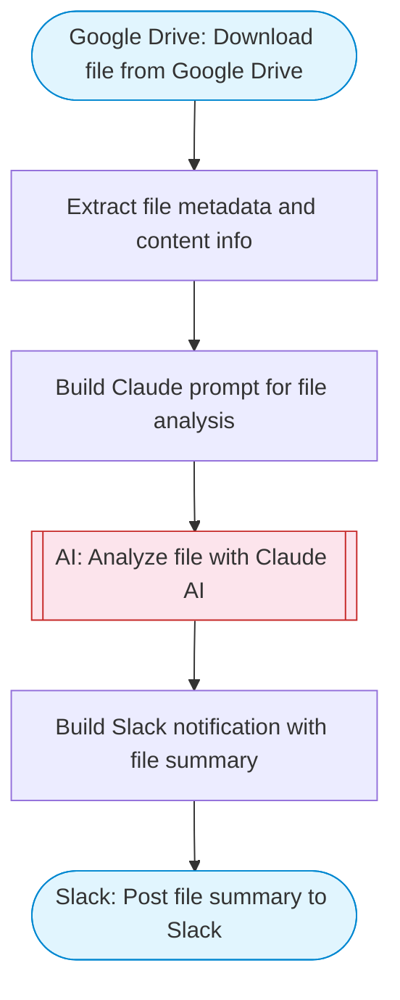

# Download and Process a File from Google Drive

Downloads a file from Google Drive by file ID, analyzes its content with Claude AI, and posts a structured summary to Slack. Useful for automated document review workflows.

> **Works with any AI agent.** Paste this page's URL into Claude Code, Codex, Cursor, Windsurf, OpenClaw, or any coding agent — it will read the docs, connect your platforms, and run this flow for you.

## Quick Start

```bash
# 1. Connect your platforms (one-time setup)
one add google-drive
one add slack

# 2. Run the flow
one flow execute n8n-515-download-file-google-drive \
  --input fileId="..." \
  --input slackChannel="C01ABC123"
```

## Platforms

| Platform | Used for |
|----------|----------|
| Google Drive | Connection key |
| Slack | Post file summary to Slack |

> Don't have these connected yet? Run `one list` to check, then `one add <platform>` to connect.

## What it does

1. Download file from Google Drive
2. Extract file metadata and content info
3. Build Claude prompt for file analysis
4. Analyze file with Claude AI
5. Post file summary to Slack

## Flow diagram



## Inputs

| Input | Required | Description |
|-------|----------|-------------|
| `fileId` | Yes | Google Drive file ID to download |
| `slackChannel` | Yes | Slack channel for file summary notification |

---

<sub>Based on [n8n #515](https://n8n.io/workflows/515) · 22.5K views on n8n · by [sm-amudhan](https://n8n.io/creators/sm-amudhan) · Converted to One CLI on 2026-03-25</sub>
