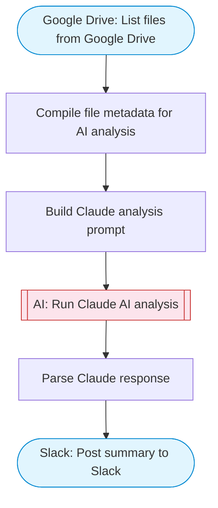

# Google Drive File Summarizer

List files from Google Drive, use Claude AI to summarize their content, and post a structured summary to Slack. Ideal for quickly digesting documents across a Drive folder.

> **Works with any AI agent.** Paste this page's URL into Claude Code, Codex, Cursor, Windsurf, OpenClaw, or any coding agent — it will read the docs, connect your platforms, and run this flow for you.

## Quick Start

```bash
# 1. Connect your platforms (one-time setup)
one add google-drive
one add slack

# 2. Run the flow
one flow execute n8n-1962-drive-summarizer \
  --input slackChannel="C01ABC123" \
  --input driveQuery="your question here" \
  --input maxFiles="10"
```

## Platforms

| Platform | Used for |
|----------|----------|
| Google Drive | List files from Google Drive |
| Slack | Post summary to Slack |

> Don't have these connected yet? Run `one list` to check, then `one add <platform>` to connect.

## What it does

1. List files from Google Drive
2. Compile file metadata for AI analysis
3. Build Claude analysis prompt
4. Run Claude AI analysis
5. Parse Claude response
6. Post summary to Slack

## Flow diagram



## Inputs

| Input | Required | Description |
|-------|----------|-------------|
| `slackChannel` | Yes | Slack channel ID to post the file summaries |
| `driveQuery` | No | Google Drive search query to filter files (default: all non-folder files) (default: mimeType != 'application/vnd.google-apps.folder') |
| `maxFiles` | No | Maximum number of files to summarize (default: 10) |

---

<sub>Based on [n8n #1962](https://n8n.io/workflows/1962) · 35.7K views on n8n · by [n8n-team](https://n8n.io/creators/n8n-team) · Converted to One CLI on 2026-03-25</sub>
