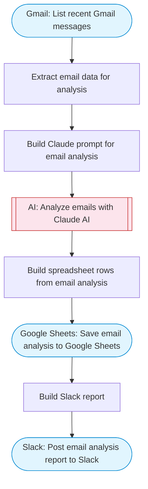

# AI email analyzer with PDF processing and Google Sheets logging

Lists recent Gmail messages, uses Claude AI to analyze email content and extract key data, saves structured summaries to Google Sheets, and posts a consolidated report to Slack.

> **Works with any AI agent.** Paste this page's URL into Claude Code, Codex, Cursor, Windsurf, OpenClaw, or any coding agent — it will read the docs, connect your platforms, and run this flow for you.

## Quick Start

```bash
# 1. Connect your platforms (one-time setup)
one add gmail
one add google-sheets
one add slack

# 2. Run the flow
one flow execute n8n-3169-email-analyzer \
  --input slackChannel="C01ABC123" \
  --input maxEmails="user@example.com" \
  --input spreadsheetName="..."
```

## Platforms

| Platform | Used for |
|----------|----------|
| Gmail | Listing emails |
| Google Sheets | Saving summaries |
| Slack | Report delivery |

> Don't have these connected yet? Run `one list` to check, then `one add <platform>` to connect.

## What it does

1. List recent Gmail messages
2. Extract email data for analysis
3. Build Claude prompt for email analysis
4. Analyze emails with Claude AI
5. Build spreadsheet rows from email analysis
6. Save email analysis to Google Sheets
7. Build Slack report
8. Post email analysis report to Slack

## Flow diagram



## Inputs

| Input | Required | Description |
|-------|----------|-------------|
| `slackChannel` | Yes | Slack channel for the email analysis report |
| `maxEmails` | No | Maximum number of recent emails to analyze (default: 10) |
| `spreadsheetName` | No | Name for the Google Sheets spreadsheet (default: Email Analysis Report) |

---

<sub>Based on [n8n #3169](https://n8n.io/workflows/3169) · 28.6K views on n8n · by [n3witalia](https://n8n.io/creators/n3witalia) · Converted to One CLI on 2026-03-25</sub>
