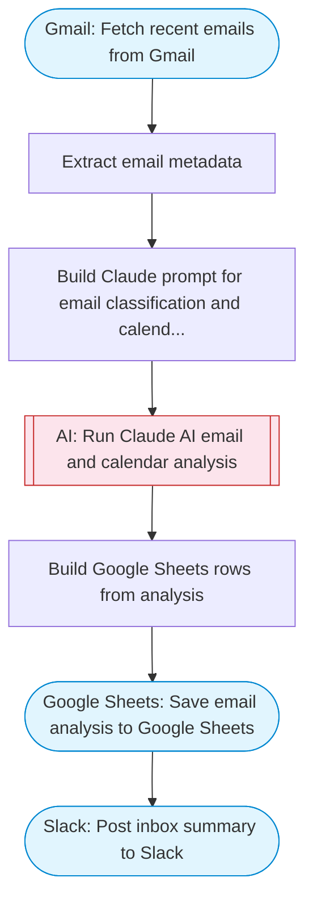

# AI Email & Calendar Management Assistant

Fetches recent Gmail messages, uses Claude AI to classify, prioritize, and suggest replies and meeting times, then saves the organized inbox report to Google Sheets and posts a summary to Slack. Adapted from n8n's Gmail + Google Calendar AI management workflow.

> **Works with any AI agent.** Paste this page's URL into Claude Code, Codex, Cursor, Windsurf, OpenClaw, or any coding agent — it will read the docs, connect your platforms, and run this flow for you.

## Quick Start

```bash
# 1. Connect your platforms (one-time setup)
one add gmail
one add google-sheets
one add slack

# 2. Run the flow
one flow execute n8n-4366-email-calendar-ai \
  --input spreadsheetId="..." \
  --input slackChannel="C01ABC123" \
  --input searchQuery="your question here" \
  --input maxEmails="user@example.com"
```

## Platforms

| Platform | Used for |
|----------|----------|
| Gmail | Listing emails |
| Google Sheets | Saving the report |
| Slack | Posting the summary |

> Don't have these connected yet? Run `one list` to check, then `one add <platform>` to connect.

## What it does

1. Fetch recent emails from Gmail
2. Extract email metadata
3. Build Claude prompt for email classification and calendar management
4. Run Claude AI email and calendar analysis
5. Save email analysis to Google Sheets
6. Post inbox summary to Slack

## Flow diagram



## Inputs

| Input | Required | Description |
|-------|----------|-------------|
| `spreadsheetId` | Yes | Google Sheets spreadsheet ID to save inbox analysis |
| `slackChannel` | Yes | Slack channel ID to post the inbox summary |
| `searchQuery` | No | Gmail search query to filter emails (default: last 24 hours) (default: newer_than:1d) |
| `maxEmails` | No | Maximum number of emails to process (default: 20) |

---

<sub>Based on [n8n #4366](https://n8n.io/workflows/4366) · 20.8K views on n8n · by [aoepeople](https://n8n.io/creators/aoepeople) · Converted to One CLI on 2026-03-25</sub>
