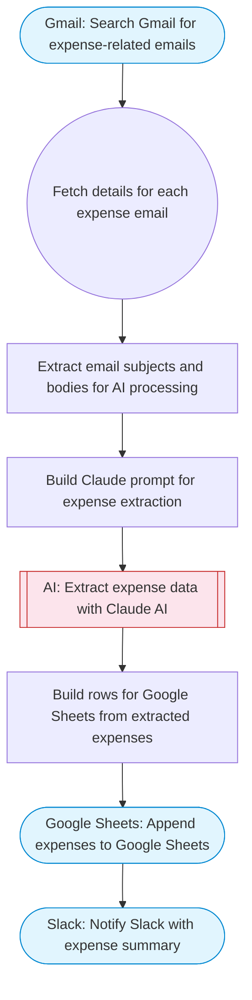

# Extract Expenses from Emails and Add to Google Sheets

Searches Gmail for expense-related emails (receipts, invoices), uses Claude AI to extract expense data (date, amount, vendor, category), and appends structured rows to a Google Sheet for tracking.

> **Works with any AI agent.** Paste this page's URL into Claude Code, Codex, Cursor, Windsurf, OpenClaw, or any coding agent — it will read the docs, connect your platforms, and run this flow for you.

## Quick Start

```bash
# 1. Connect your platforms (one-time setup)
one add gmail
one add google-sheets
one add slack

# 2. Run the flow
one flow execute n8n-1466-email-expense-extractor \
  --input spreadsheetId="..." \
  --input sheetName="..." \
  --input searchQuery="your question here" \
  --input slackChannel="C01ABC123"
```

## Platforms

| Platform | Used for |
|----------|----------|
| Gmail | Reading emails |
| Google Sheets | Connection key |
| Slack | Notifications |

> Don't have these connected yet? Run `one list` to check, then `one add <platform>` to connect.

## What it does

1. Search Gmail for expense-related emails
2. Fetch details for each expense email
3. Extract email subjects and bodies for AI processing
4. Build Claude prompt for expense extraction
5. Extract expense data with Claude AI
6. Build rows for Google Sheets from extracted expenses
7. Append expenses to Google Sheets
8. Notify Slack with expense summary

## Flow diagram



## Inputs

| Input | Required | Description |
|-------|----------|-------------|
| `spreadsheetId` | Yes | Google Sheets spreadsheet ID for expense tracking |
| `sheetName` | No | Sheet tab name (default: Expenses) |
| `searchQuery` | No | Gmail search query to find expense emails (default: subject:(receipt OR invoice OR expense OR payment) newer_than:7d) |
| `slackChannel` | Yes | Slack channel for expense summary notification |

---

<sub>Based on [n8n #1466](https://n8n.io/workflows/1466) · 22.7K views on n8n · by [jon-n8n](https://n8n.io/creators/jon-n8n) · Converted to One CLI on 2026-03-25</sub>
