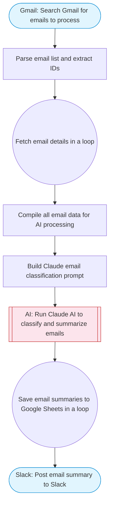

# Email Filter + Summarize — Gmail fetch, Claude categorizes, save to Sheets

Fetches emails from Gmail, uses Claude AI to categorize and summarize each email (priority, category, action items), and saves the structured summaries to Google Sheets for tracking and analysis.

> **Works with any AI agent.** Paste this page's URL into Claude Code, Codex, Cursor, Windsurf, OpenClaw, or any coding agent — it will read the docs, connect your platforms, and run this flow for you.

## Quick Start

```bash
# 1. Connect your platforms (one-time setup)
one add gmail
one add gmail
one add google-sheets
one add slack

# 2. Run the flow
one flow execute n8n-5678-email-filter-summarize \
  --input slackChannel="C01ABC123" \
  --input spreadsheetUrl="https://example.com" \
  --input sheetName="..." \
  --input gmailQuery="your question here" \
  --input maxEmails="user@example.com" \
  --input categories="..."
```

## Platforms

| Platform | Used for |
|----------|----------|
| Gmail | Listing emails |
| Gmail | Getting email details |
| Google Sheets | Saving summaries |
| Slack | Notifications |

> Don't have these connected yet? Run `one list` to check, then `one add <platform>` to connect.

## What it does

1. Search Gmail for emails to process
2. Parse email list and extract IDs
3. Fetch email details in a loop
4. Compile all email data for AI processing
5. Build Claude email classification prompt
6. Run Claude AI to classify and summarize emails
7. Save email summaries to Google Sheets in a loop
8. Post email summary to Slack

## Flow diagram



## Inputs

| Input | Required | Description |
|-------|----------|-------------|
| `slackChannel` | Yes | Slack channel ID for summary notifications |
| `spreadsheetUrl` | Yes | Google Sheets URL to save email summaries (columns: Date, From, Subject, Category, Priority, Summary, ActionItems, Status) |
| `sheetName` | No | Sheet tab name (default: Sheet1) |
| `gmailQuery` | No | Gmail search query to filter emails (default: is:unread newer_than:1d) |
| `maxEmails` | No | Maximum number of emails to process (default: 15) |
| `categories` | No | Comma-separated list of email categories to classify into (default: work, personal, newsletter, marketing, billing, notification, spam) |

---

<sub>Based on [n8n #5678](https://n8n.io/workflows/5678) · 35.8K views on n8n · by [arre](https://n8n.io/creators/arre) · Converted to One CLI on 2026-03-25</sub>
