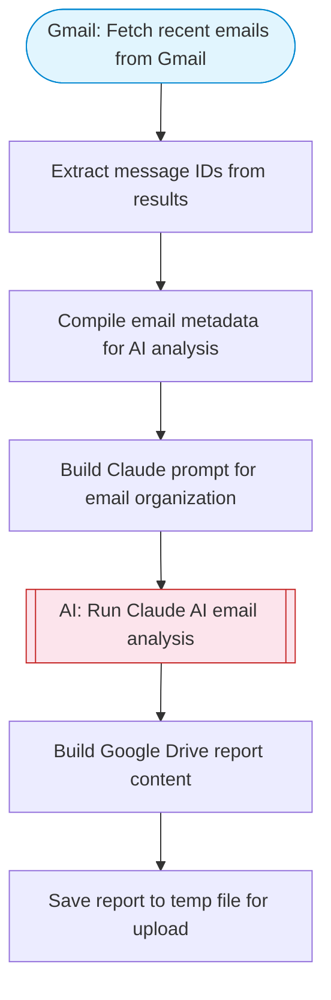

# AI-powered email management and summarization

Fetches recent emails from Gmail, uses Claude AI to organize, categorize, and prioritize them, then saves a structured summary report to Google Drive. Adapted from n8n's AI-powered email management and summarization workflow.

> **Works with any AI agent.** Paste this page's URL into Claude Code, Codex, Cursor, Windsurf, OpenClaw, or any coding agent — it will read the docs, connect your platforms, and run this flow for you.

## Quick Start

```bash
# 1. Connect your platforms (one-time setup)
one add gmail
one add google-drive

# 2. Run the flow
one flow execute n8n-190-email-management-ai \
  --input searchQuery="your question here" \
  --input maxEmails="user@example.com" \
  --input driveFolderId="..."
```

## Platforms

| Platform | Used for |
|----------|----------|
| Gmail | Listing emails |
| Google Drive | Saving the summary report |

> Don't have these connected yet? Run `one list` to check, then `one add <platform>` to connect.

## What it does

1. Fetch recent emails from Gmail
2. Extract message IDs from results
3. Compile email metadata for AI analysis
4. Build Claude prompt for email organization
5. Run Claude AI email analysis
6. Build Google Drive report content
7. Save report to temp file for upload

## Flow diagram



## Inputs

| Input | Required | Description |
|-------|----------|-------------|
| `searchQuery` | No | Gmail search query to filter emails (default: last 24 hours) (default: newer_than:1d) |
| `maxEmails` | No | Maximum number of emails to process (default: 20) (default: 20) |
| `driveFolderId` | No | Google Drive folder ID to save the summary report (default: root) |

---

<sub>Based on [n8n #190](https://n8n.io/workflows/190) · 32.2K views on n8n · Converted to One CLI on 2026-03-25</sub>
