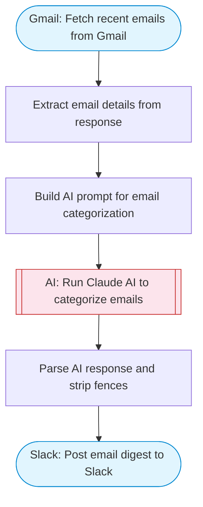

# Email Organizer — Gmail Fetch + AI Categorization to Slack

Fetches recent emails from Gmail inbox, uses Claude AI to categorize each with smart labels (urgent, follow-up, FYI, etc.), and posts an organized digest to Slack.

> **Works with any AI agent.** Paste this page's URL into Claude Code, Codex, Cursor, Windsurf, OpenClaw, or any coding agent — it will read the docs, connect your platforms, and run this flow for you.

## Quick Start

```bash
# 1. Connect your platforms (one-time setup)
one add gmail
one add slack

# 2. Run the flow
one flow execute n8n-4557-email-organizer \
  --input slackChannel="C01ABC123" \
  --input maxEmails="user@example.com"
```

## Platforms

| Platform | Used for |
|----------|----------|
| Gmail | Fetch recent emails from Gmail |
| Slack | Post email digest to Slack |

> Don't have these connected yet? Run `one list` to check, then `one add <platform>` to connect.

## What it does

1. Fetch recent emails from Gmail
2. Extract email details from response
3. Build AI prompt for email categorization
4. Run Claude AI to categorize emails
5. Parse AI response and strip fences
6. Post email digest to Slack

## Flow diagram



## Inputs

| Input | Required | Description |
|-------|----------|-------------|
| `slackChannel` | Yes | Slack channel ID to post the email digest |
| `maxEmails` | No | Maximum number of emails to fetch and categorize (default: 10) |

---

<sub>Based on [n8n #4557](https://n8n.io/workflows/4557) · 43.5K views on n8n · by [niranjan](https://n8n.io/creators/niranjan) · Converted to One CLI on 2026-03-25</sub>
