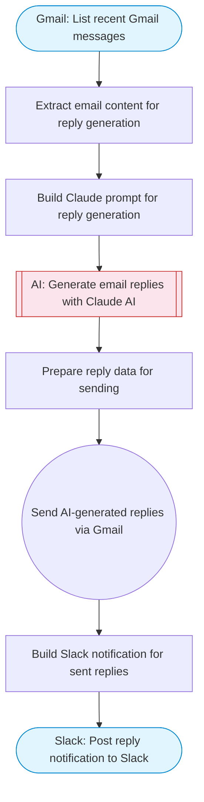

# Reply to emails with AI using Gmail and Claude

Lists recent Gmail messages, uses Claude AI to analyze each email and generate context-aware reply drafts matching a specified tone and style, sends the replies via Gmail, and reports activity to Slack.

> **Works with any AI agent.** Paste this page's URL into Claude Code, Codex, Cursor, Windsurf, OpenClaw, or any coding agent — it will read the docs, connect your platforms, and run this flow for you.

## Quick Start

```bash
# 1. Connect your platforms (one-time setup)
one add gmail
one add gmail
one add slack

# 2. Run the flow
one flow execute n8n-3089-email-reply-ai \
  --input slackChannel="C01ABC123" \
  --input replyTone="..." \
  --input sampleReplies="..." \
  --input maxEmails="user@example.com" \
  --input senderName="Alex"
```

## Platforms

| Platform | Used for |
|----------|----------|
| Gmail | Listing emails |
| Gmail | Sending replies |
| Slack | Notifications |

> Don't have these connected yet? Run `one list` to check, then `one add <platform>` to connect.

## What it does

1. List recent Gmail messages
2. Extract email content for reply generation
3. Build Claude prompt for reply generation
4. Generate email replies with Claude AI
5. Prepare reply data for sending
6. Send AI-generated replies via Gmail
7. Post reply notification to Slack

## Flow diagram



## Inputs

| Input | Required | Description |
|-------|----------|-------------|
| `slackChannel` | Yes | Slack channel for email reply notifications |
| `replyTone` | No | Tone for AI-generated replies (e.g. 'formal', 'friendly', 'concise') (default: professional and helpful) |
| `sampleReplies` | No | Sample email replies to train the AI on your writing style (default: ) |
| `maxEmails` | No | Maximum emails to process (default: 5) |
| `senderName` | No | Your name for the email signature (default: ) |

---

<sub>Based on [n8n #3089](https://n8n.io/workflows/3089) · 27.6K views on n8n · by [ryanh](https://n8n.io/creators/ryanh) · Converted to One CLI on 2026-03-25</sub>
