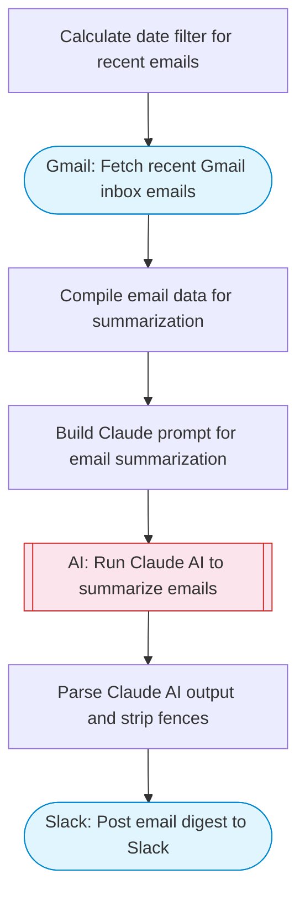

# AI Email Summary Agent

Fetches recent Gmail inbox emails, uses Claude AI to summarize all messages into a structured daily digest with categories, action items, and priority rankings, then posts the summary to Slack using Block Kit formatting.

> **Works with any AI agent.** Paste this page's URL into Claude Code, Codex, Cursor, Windsurf, OpenClaw, or any coding agent — it will read the docs, connect your platforms, and run this flow for you.

## Quick Start

```bash
# 1. Connect your platforms (one-time setup)
one add gmail
one add slack

# 2. Run the flow
one flow execute n8n-2722-email-summary-agent \
  --input slackChannel="C01ABC123" \
  --input hoursBack="..."
```

## Platforms

| Platform | Used for |
|----------|----------|
| Gmail | Reading emails |
| Slack | Posting the digest |

> Don't have these connected yet? Run `one list` to check, then `one add <platform>` to connect.

## What it does

1. Calculate date filter for recent emails
2. Fetch recent Gmail inbox emails
3. Compile email data for summarization
4. Build Claude prompt for email summarization
5. Run Claude AI to summarize emails
6. Parse Claude AI output and strip fences
7. Post email digest to Slack

## Flow diagram



## Inputs

| Input | Required | Description |
|-------|----------|-------------|
| `slackChannel` | Yes | Slack channel to post the email summary (e.g. '#daily-digest') |
| `hoursBack` | No | Number of hours to look back for emails (default: 24) (default: 24) |

---

<sub>Based on [n8n #2722](https://n8n.io/workflows/2722) · 82.6K views on n8n · by [vishalquantana](https://n8n.io/creators/vishalquantana) · Converted to One CLI on 2026-03-25</sub>
