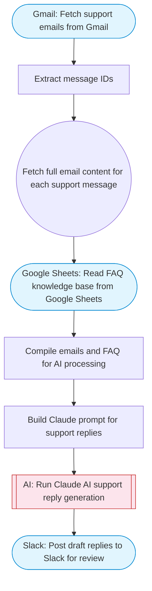

# Email support agent with AI-powered Gmail replies

Fetches new support emails from Gmail, reads FAQ/knowledge data from Google Sheets, uses Claude AI to draft contextual reply suggestions, and posts the draft replies to Slack for review before sending. Adapted from n8n's email support agent with Gemini/GPT fallback workflow.

> **Works with any AI agent.** Paste this page's URL into Claude Code, Codex, Cursor, Windsurf, OpenClaw, or any coding agent — it will read the docs, connect your platforms, and run this flow for you.

## Quick Start

```bash
# 1. Connect your platforms (one-time setup)
one add gmail
one add google-sheets
one add slack

# 2. Run the flow
one flow execute n8n-6287-email-support-agent \
  --input slackChannel="C01ABC123" \
  --input searchQuery="your question here" \
  --input maxEmails="user@example.com" \
  --input spreadsheetId="..." \
  --input faqRange="..." \
  --input companyName="..." \
  --input supportTone="..."
```

## Platforms

| Platform | Used for |
|----------|----------|
| Gmail | Reading support emails |
| Google Sheets | Faq/knowledge base |
| Slack | Draft review |

> Don't have these connected yet? Run `one list` to check, then `one add <platform>` to connect.

## What it does

1. Fetch support emails from Gmail
2. Extract message IDs
3. Fetch full email content for each support message
4. Read FAQ knowledge base from Google Sheets
5. Compile emails and FAQ for AI processing
6. Build Claude prompt for support replies
7. Run Claude AI support reply generation
8. Post draft replies to Slack for review

## Flow diagram



## Inputs

| Input | Required | Description |
|-------|----------|-------------|
| `slackChannel` | Yes | Slack channel ID for reviewing draft replies |
| `searchQuery` | No | Gmail search query for support emails (default: newer_than:1d is:unread label:support) |
| `maxEmails` | No | Maximum number of support emails to process (default: 10) |
| `spreadsheetId` | Yes | Google Sheets spreadsheet ID with FAQ/knowledge base |
| `faqRange` | No | Sheet range with columns: Question, Answer (default: FAQ!A1:B100) |
| `companyName` | No | Company name for email signatures (default: Support Team) |
| `supportTone` | No | Tone for support replies (default: professional, friendly, and helpful) |

---

<sub>Based on [n8n #6287](https://n8n.io/workflows/6287) · 28.9K views on n8n · by [dae221](https://n8n.io/creators/dae221) · Converted to One CLI on 2026-03-25</sub>
