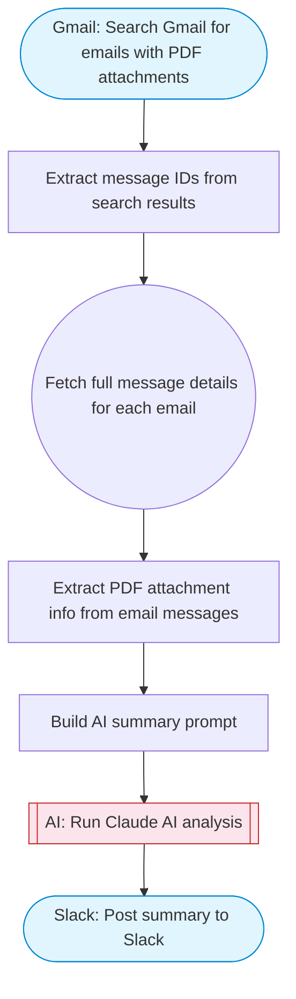

# Extract text from a PDF file

PDF text extraction pipeline: searches Gmail for emails with PDF attachments, extracts attachment metadata, uses Claude AI to summarize the PDF information found, and posts a formatted summary to Slack with Block Kit.

> **Works with any AI agent.** Paste this page's URL into Claude Code, Codex, Cursor, Windsurf, OpenClaw, or any coding agent — it will read the docs, connect your platforms, and run this flow for you.

## Quick Start

```bash
# 1. Connect your platforms (one-time setup)
one add gmail
one add slack

# 2. Run the flow
one flow execute n8n-585-extract-text-pdf \
  --input searchQuery="your question here" \
  --input maxEmails="user@example.com" \
  --input slackChannel="C01ABC123"
```

## Platforms

| Platform | Used for |
|----------|----------|
| Gmail | Search Gmail for emails with PDF attachments |
| Slack | Post summary to Slack |

> Don't have these connected yet? Run `one list` to check, then `one add <platform>` to connect.

## What it does

1. Search Gmail for emails with PDF attachments
2. Extract message IDs from search results
3. Fetch full message details for each email
4. Extract PDF attachment info from email messages
5. Build AI summary prompt
6. Run Claude AI analysis
7. Post summary to Slack

## Flow diagram



## Inputs

| Input | Required | Description |
|-------|----------|-------------|
| `searchQuery` | No | Gmail search query to find emails with PDFs (default: 'has:attachment filename:pdf') (default: has:attachment filename:pdf) |
| `maxEmails` | No | Maximum number of emails to process (default: 5) (default: 5) |
| `slackChannel` | Yes | Slack channel ID to post the summary |

---

<sub>Based on [n8n #585](https://n8n.io/workflows/585) · 150.7K views on n8n · by [sm-amudhan](https://n8n.io/creators/sm-amudhan) · Converted to One CLI on 2026-03-24</sub>
