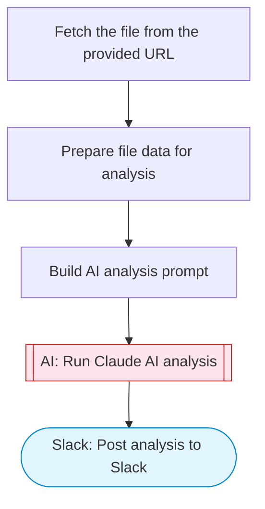

# File Data Reader & Analyzer

Fetches a file from a URL, uses Claude AI to extract and transform the data into structured insights, and posts a formatted summary to Slack with Block Kit formatting. Adapted from n8n's Excel spreadsheet reader workflow.

> **Works with any AI agent.** Paste this page's URL into Claude Code, Codex, Cursor, Windsurf, OpenClaw, or any coding agent — it will read the docs, connect your platforms, and run this flow for you.

## Quick Start

```bash
# 1. Connect your platforms (one-time setup)
one add slack

# 2. Run the flow
one flow execute n8n-890-file-data-reader \
  --input fileUrl="https://example.com" \
  --input analysisGoal="..." \
  --input slackChannel="C01ABC123"
```

## Platforms

| Platform | Used for |
|----------|----------|
| Slack | Posting results |

> Don't have these connected yet? Run `one list` to check, then `one add <platform>` to connect.

## What it does

1. Fetch the file from the provided URL
2. Prepare file data for analysis
3. Build AI analysis prompt
4. Run Claude AI analysis
5. Post analysis to Slack

## Flow diagram



## Inputs

| Input | Required | Description |
|-------|----------|-------------|
| `fileUrl` | Yes | URL of the file to fetch and analyze (CSV, JSON, or text) |
| `analysisGoal` | No | What to analyze or extract from the file data (default: Summarize the data, identify key patterns, and highlight notable values) |
| `slackChannel` | Yes | Slack channel ID to post the analysis |

---

<sub>Based on [n8n #890](https://n8n.io/workflows/890) · 51.4K views on n8n · by [sinkibo](https://n8n.io/creators/sinkibo) · Converted to One CLI on 2026-03-25</sub>
