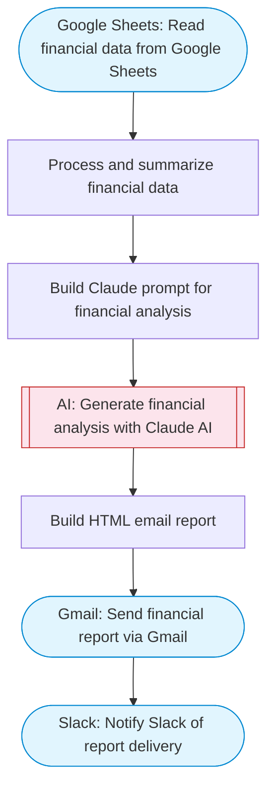

# Generate Monthly Financial Reports with AI Analysis

Reads financial data from a Google Sheet, uses Claude AI to generate comprehensive financial analysis with trends and recommendations, creates an HTML report, sends the report via Gmail, and posts a summary to Slack.

> **Works with any AI agent.** Paste this page's URL into Claude Code, Codex, Cursor, Windsurf, OpenClaw, or any coding agent — it will read the docs, connect your platforms, and run this flow for you.

## Quick Start

```bash
# 1. Connect your platforms (one-time setup)
one add google-sheets
one add gmail
one add slack

# 2. Run the flow
one flow execute n8n-3617-financial-report-generator \
  --input spreadsheetId="..." \
  --input dataRange="..." \
  --input reportRecipient="..." \
  --input companyName="..." \
  --input slackChannel="C01ABC123"
```

## Platforms

| Platform | Used for |
|----------|----------|
| Google Sheets | Financial data source |
| Gmail | Sending reports |
| Slack | Notify Slack of report delivery |

> Don't have these connected yet? Run `one list` to check, then `one add <platform>` to connect.

## What it does

1. Read financial data from Google Sheets
2. Process and summarize financial data
3. Build Claude prompt for financial analysis
4. Generate financial analysis with Claude AI
5. Build HTML email report
6. Send financial report via Gmail
7. Notify Slack of report delivery

## Flow diagram



## Inputs

| Input | Required | Description |
|-------|----------|-------------|
| `spreadsheetId` | Yes | Google Sheets spreadsheet ID containing financial data |
| `dataRange` | No | Sheet range containing financial data (columns: Date, Category, Description, Amount, Type, Account) (default: Financial Data!A:F) |
| `reportRecipient` | Yes | Email address to send the financial report to |
| `companyName` | No | Company name for the report header (default: Company) |
| `slackChannel` | Yes | Slack channel for report notification |

---

<sub>Based on [n8n #3617](https://n8n.io/workflows/3617) · 21.7K views on n8n · by [amjid](https://n8n.io/creators/amjid) · Converted to One CLI on 2026-03-25</sub>
