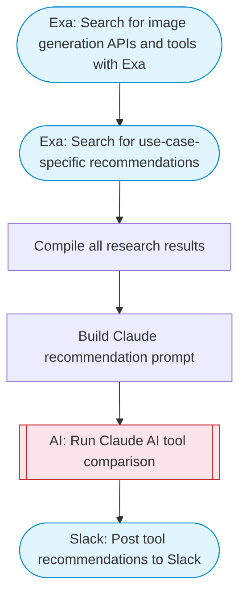

# Image generation API research and recommendations

Researches image generation APIs and services using Exa search, uses Claude AI to compare providers and recommend the best tools for specific use cases, and posts the analysis to Slack.

> **Works with any AI agent.** Paste this page's URL into Claude Code, Codex, Cursor, Windsurf, OpenClaw, or any coding agent — it will read the docs, connect your platforms, and run this flow for you.

## Quick Start

```bash
# 1. Connect your platforms (one-time setup)
one add exa
one add slack

# 2. Run the flow
one flow execute n8n-5811-flux-image-generator \
  --input slackChannel="C01ABC123" \
  --input useCase="..." \
  --input requirements="..."
```

## Platforms

| Platform | Used for |
|----------|----------|
| Exa | Web search |
| Slack | Post tool recommendations to Slack |

> Don't have these connected yet? Run `one list` to check, then `one add <platform>` to connect.

## What it does

1. Search for image generation APIs and tools with Exa
2. Search for use-case-specific recommendations
3. Compile all research results
4. Build Claude recommendation prompt
5. Run Claude AI tool comparison
6. Post tool recommendations to Slack

## Flow diagram



## Inputs

| Input | Required | Description |
|-------|----------|-------------|
| `slackChannel` | Yes | Slack channel to post the research results |
| `useCase` | Yes | Image generation use case to research (e.g. 'product photography', 'marketing banners', 'social media content', 'logo design') |
| `requirements` | No | Specific requirements (e.g. 'must have API access', 'free tier needed', 'high resolution output') (default: ) |

---

<sub>Based on [n8n #5811](https://n8n.io/workflows/2417) · 84.8K views on n8n · by [baptistefort](https://n8n.io/creators/baptistefort) · Converted to One CLI on 2026-03-25</sub>
