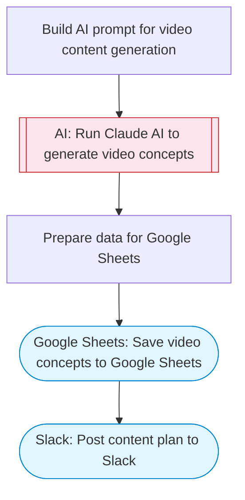

# AI Video Content Planner

Generate video content ideas and full scripts using Claude AI. Produces concepts with titles, hooks, scripts, and hashtags for social media video content, then saves everything to a Google Sheets tracking spreadsheet.

> **Works with any AI agent.** Paste this page's URL into Claude Code, Codex, Cursor, Windsurf, OpenClaw, or any coding agent — it will read the docs, connect your platforms, and run this flow for you.

## Quick Start

```bash
# 1. Connect your platforms (one-time setup)
one add google-sheets
one add slack

# 2. Run the flow
one flow execute n8n-5035-generate-auto-post-videos \
  --input niche="..." \
  --input videoCount="..." \
  --input slackChannel="C01ABC123"
```

## Platforms

| Platform | Used for |
|----------|----------|
| Google Sheets | Connection key |
| Slack | Post content plan to Slack |

> Don't have these connected yet? Run `one list` to check, then `one add <platform>` to connect.

## What it does

1. Build AI prompt for video content generation
2. Run Claude AI to generate video concepts
3. Prepare data for Google Sheets
4. Save video concepts to Google Sheets
5. Post content plan to Slack

## Flow diagram



## Inputs

| Input | Required | Description |
|-------|----------|-------------|
| `niche` | Yes | Content niche or topic area (e.g. 'AI productivity tips', 'cooking hacks', 'fitness motivation') |
| `videoCount` | No | Number of video concepts to generate (1-10) (default: 5) |
| `slackChannel` | Yes | Slack channel ID to post the content plan |

---

<sub>Based on [n8n #5035](https://n8n.io/workflows/5035) · 233.0K views on n8n · by [drfiras](https://n8n.io/creators/drfiras) · Converted to One CLI on 2026-03-24</sub>
