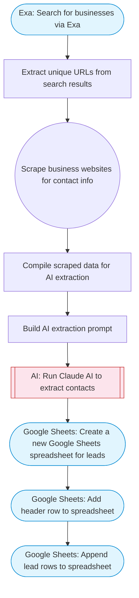

# Generate leads with Google Maps

Automated lead generation pipeline: searches for businesses using Exa, scrapes their websites with Firecrawl, uses Claude AI to extract contact information, and saves structured leads to a new Google Sheets spreadsheet.

> **Works with any AI agent.** Paste this page's URL into Claude Code, Codex, Cursor, Windsurf, OpenClaw, or any coding agent — it will read the docs, connect your platforms, and run this flow for you.

## Quick Start

```bash
# 1. Connect your platforms (one-time setup)
one add exa
one add firecrawl
one add google-sheets

# 2. Run the flow
one flow execute n8n-2605-generate-leads-google \
  --input searchQuery="your question here" \
  --input maxResults="10"
```

## Platforms

| Platform | Used for |
|----------|----------|
| Exa | Search for businesses via Exa |
| Firecrawl | Web scraping |
| Google Sheets | Create a new Google Sheets spreadsheet for leads |

> Don't have these connected yet? Run `one list` to check, then `one add <platform>` to connect.

## What it does

1. Search for businesses via Exa
2. Extract unique URLs from search results
3. Scrape business websites for contact info
4. Compile scraped data for AI extraction
5. Build AI extraction prompt
6. Run Claude AI to extract contacts
7. Create a new Google Sheets spreadsheet for leads
8. Add header row to spreadsheet
9. Append lead rows to spreadsheet

## Flow diagram



## Inputs

| Input | Required | Description |
|-------|----------|-------------|
| `searchQuery` | Yes | Business type and location to search for (e.g. 'plumbers in Austin TX', 'dentists in Chicago') |
| `maxResults` | No | Maximum number of businesses to find (default 10) (default: 10) |

---

<sub>Based on [n8n #2605](https://n8n.io/workflows/2605) · 176.5K views on n8n · by [alexk1919](https://n8n.io/creators/alexk1919) · Converted to One CLI on 2026-03-24</sub>
