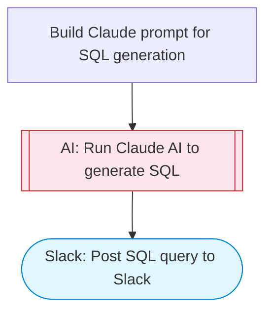

# AI SQL query generator from natural language

Takes a natural language question and a database schema description, uses Claude AI to generate the correct SQL query, explains the query logic, and posts both the SQL and explanation to Slack with Block Kit formatting.

> **Works with any AI agent.** Paste this page's URL into Claude Code, Codex, Cursor, Windsurf, OpenClaw, or any coding agent — it will read the docs, connect your platforms, and run this flow for you.

## Quick Start

```bash
# 1. Connect your platforms (one-time setup)
one add slack

# 2. Run the flow
one flow execute n8n-2508-generate-sql-queries \
  --input slackChannel="C01ABC123" \
  --input question="your question here" \
  --input schemaDescription="..." \
  --input databaseType="..." \
  --input additionalContext="..."
```

## Platforms

| Platform | Used for |
|----------|----------|
| Slack | Posting generated sql |

> Don't have these connected yet? Run `one list` to check, then `one add <platform>` to connect.

## What it does

1. Build Claude prompt for SQL generation
2. Run Claude AI to generate SQL
3. Post SQL query to Slack

## Flow diagram



## Inputs

| Input | Required | Description |
|-------|----------|-------------|
| `slackChannel` | Yes | Slack channel ID to post the SQL query result |
| `question` | Yes | Natural language question to convert to SQL (e.g. 'Show me all customers who placed orders in the last 30 days') |
| `schemaDescription` | Yes | Database schema description (table names, columns, relationships). Can be CREATE TABLE statements or plain text description. |
| `databaseType` | No | Database type: PostgreSQL, MySQL, SQLite, SQL Server, Oracle (default: PostgreSQL) |
| `additionalContext` | No | Additional context about naming conventions, business rules, or data specifics (default: ) |

---

<sub>Based on [n8n #2508](https://n8n.io/workflows/2508) · 54.7K views on n8n · by [yulia](https://n8n.io/creators/yulia) · Converted to One CLI on 2026-03-25</sub>
