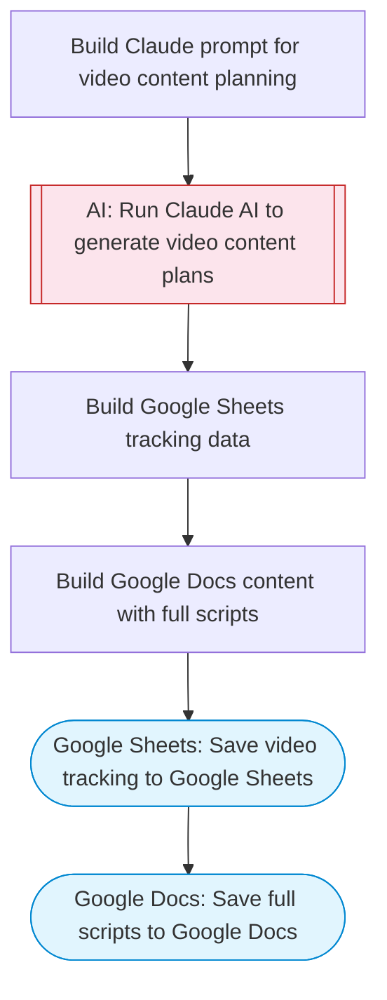

# AI Video Content Planner

Takes a topic, uses Claude AI to generate multiple video concepts with full scripts, SEO-optimized YouTube titles and descriptions, thumbnail ideas, and production notes. Saves the plan to Google Sheets for tracking and full scripts to Google Docs.

> **Works with any AI agent.** Paste this page's URL into Claude Code, Codex, Cursor, Windsurf, OpenClaw, or any coding agent — it will read the docs, connect your platforms, and run this flow for you.

## Quick Start

```bash
# 1. Connect your platforms (one-time setup)
one add google-sheets
one add google-docs

# 2. Run the flow
one flow execute n8n-4846-generate-videos-google \
  --input topic="your topic here" \
  --input videoCount="..." \
  --input channelStyle="C01ABC123"
```

## Platforms

| Platform | Used for |
|----------|----------|
| Google Sheets | Connection key |
| Google Docs | Connection key |

> Don't have these connected yet? Run `one list` to check, then `one add <platform>` to connect.

## What it does

1. Build Claude prompt for video content planning
2. Run Claude AI to generate video content plans
3. Build Google Docs content with full scripts
4. Save video tracking to Google Sheets
5. Save full scripts to Google Docs

## Flow diagram



## Inputs

| Input | Required | Description |
|-------|----------|-------------|
| `topic` | Yes | Video topic or niche (e.g. 'AI productivity tools for remote workers') |
| `videoCount` | No | Number of video concepts to generate (1-10) (default: 5) |
| `channelStyle` | No | Channel style/tone (e.g. 'entertaining', 'tutorial-focused', 'documentary') (default: educational and engaging) |

---

<sub>Based on [n8n #4846](https://n8n.io/workflows/4846) · 253.2K views on n8n · by [n3witalia](https://n8n.io/creators/n3witalia) · Converted to One CLI on 2026-03-24</sub>
