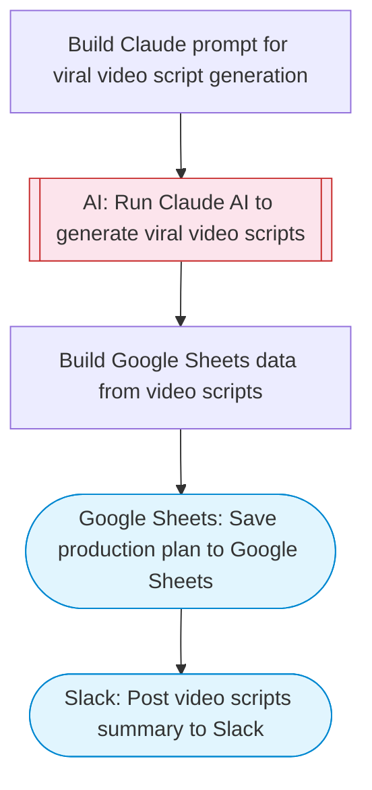

# AI Viral Video Script Generator

Takes a video concept, uses Claude AI to generate creative viral video scripts with scene-by-scene descriptions, hooks, and platform-specific variations for TikTok/YouTube Shorts/Reels. Saves the full production plan to Google Sheets and notifies Slack.

> **Works with any AI agent.** Paste this page's URL into Claude Code, Codex, Cursor, Windsurf, OpenClaw, or any coding agent — it will read the docs, connect your platforms, and run this flow for you.

## Quick Start

```bash
# 1. Connect your platforms (one-time setup)
one add google-sheets
one add slack

# 2. Run the flow
one flow execute n8n-5338-generate-viral-videos \
  --input videoConcept="..." \
  --input targetPlatforms="..." \
  --input videoCount="..." \
  --input slackChannel="C01ABC123"
```

## Platforms

| Platform | Used for |
|----------|----------|
| Google Sheets | Connection key |
| Slack | Post video scripts summary to Slack |

> Don't have these connected yet? Run `one list` to check, then `one add <platform>` to connect.

## What it does

1. Build Claude prompt for viral video script generation
2. Run Claude AI to generate viral video scripts
3. Save production plan to Google Sheets
4. Post video scripts summary to Slack

## Flow diagram



## Inputs

| Input | Required | Description |
|-------|----------|-------------|
| `videoConcept` | Yes | Video concept or topic (e.g. 'satisfying ASMR cooking video with sizzling sounds') |
| `targetPlatforms` | No | Comma-separated target platforms (default: TikTok, YouTube Shorts, Instagram Reels) |
| `videoCount` | No | Number of video variations to generate (1-5) (default: 3) |
| `slackChannel` | Yes | Slack channel ID to post notification |

---

<sub>Based on [n8n #5338](https://n8n.io/workflows/5338) · 309.8K views on n8n · by [drfiras](https://n8n.io/creators/drfiras) · Converted to One CLI on 2026-03-24</sub>
