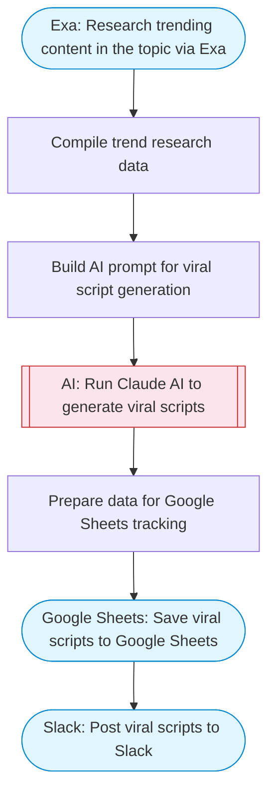

# Viral Video Script Generator

Generate viral short-form video scripts using Claude AI with trend analysis. Produces attention-grabbing scripts optimized for virality, complete with hooks, CTAs, and trending format suggestions, then tracks everything in Google Sheets.

> **Works with any AI agent.** Paste this page's URL into Claude Code, Codex, Cursor, Windsurf, OpenClaw, or any coding agent — it will read the docs, connect your platforms, and run this flow for you.

## Quick Start

```bash
# 1. Connect your platforms (one-time setup)
one add google-sheets
one add exa
one add slack

# 2. Run the flow
one flow execute n8n-8642-generate-viral-videos \
  --input topic="your topic here" \
  --input scriptCount="..." \
  --input slackChannel="C01ABC123"
```

## Platforms

| Platform | Used for |
|----------|----------|
| Google Sheets | Connection key |
| Exa | Research trending content in the topic via Exa |
| Slack | Post viral scripts to Slack |

> Don't have these connected yet? Run `one list` to check, then `one add <platform>` to connect.

## What it does

1. Research trending content in the topic via Exa
2. Compile trend research data
3. Build AI prompt for viral script generation
4. Run Claude AI to generate viral scripts
5. Prepare data for Google Sheets tracking
6. Save viral scripts to Google Sheets
7. Post viral scripts to Slack

## Flow diagram



## Inputs

| Input | Required | Description |
|-------|----------|-------------|
| `topic` | Yes | Topic or trend to create viral video scripts about (e.g. 'AI tools for students', 'morning routines') |
| `scriptCount` | No | Number of viral scripts to generate (1-5) (default: 3) |
| `slackChannel` | Yes | Slack channel ID to post results |

---

<sub>Based on [n8n #8642](https://n8n.io/workflows/8642) · 218.8K views on n8n · by [drfiras](https://n8n.io/creators/drfiras) · Converted to One CLI on 2026-03-24</sub>
