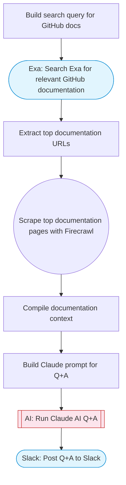

# GitHub API documentation Q&A with web search and AI

Answers questions about the GitHub API by searching for relevant documentation via Exa, scraping the results with Firecrawl, and synthesizing answers with Claude AI. Posts the Q&A to Slack. Adapted from n8n's RAG-powered GitHub API chatbot workflow.

> **Works with any AI agent.** Paste this page's URL into Claude Code, Codex, Cursor, Windsurf, OpenClaw, or any coding agent — it will read the docs, connect your platforms, and run this flow for you.

## Quick Start

```bash
# 1. Connect your platforms (one-time setup)
one add exa
one add firecrawl
one add slack

# 2. Run the flow
one flow execute n8n-2705-github-docs-chatbot \
  --input slackChannel="C01ABC123" \
  --input question="your question here"
```

## Platforms

| Platform | Used for |
|----------|----------|
| Exa | Searching github docs |
| Firecrawl | Scraping doc pages |
| Slack | Posting answers |

> Don't have these connected yet? Run `one list` to check, then `one add <platform>` to connect.

## What it does

1. Build search query for GitHub docs
2. Search Exa for relevant GitHub documentation
3. Extract top documentation URLs
4. Scrape top documentation pages with Firecrawl
5. Compile documentation context
6. Build Claude prompt for Q&A
7. Run Claude AI Q&A
8. Post Q&A to Slack

## Flow diagram



## Inputs

| Input | Required | Description |
|-------|----------|-------------|
| `slackChannel` | Yes | Slack channel ID for Q&A responses |
| `question` | Yes | Question about the GitHub API (e.g. 'How do I create a pull request via the API?') |

---

<sub>Based on [n8n #2705](https://n8n.io/workflows/2705) · 30.1K views on n8n · by [mihailtd](https://n8n.io/creators/mihailtd) · Converted to One CLI on 2026-03-25</sub>
