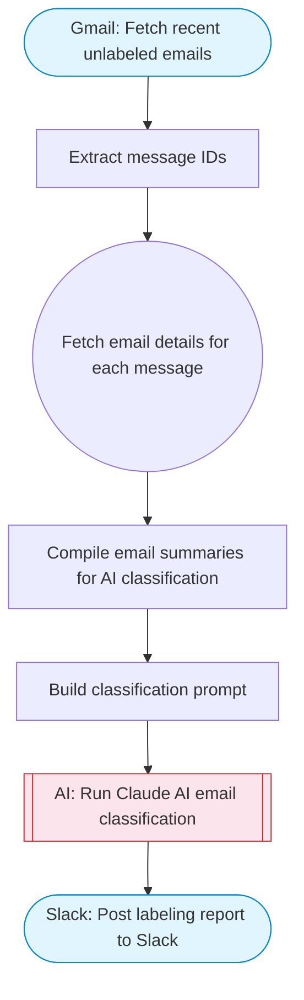

# Auto-label incoming Gmail messages with AI

Fetches recent Gmail messages, uses Claude AI to classify each email into categories (work, personal, newsletter, urgent, spam), then applies labels via Gmail API. Adapted from n8n's auto-label Gmail with AI nodes workflow.

> **Works with any AI agent.** Paste this page's URL into Claude Code, Codex, Cursor, Windsurf, OpenClaw, or any coding agent — it will read the docs, connect your platforms, and run this flow for you.

## Quick Start

```bash
# 1. Connect your platforms (one-time setup)
one add gmail
one add slack

# 2. Run the flow
one flow execute n8n-2197-gmail-auto-labeler \
  --input slackChannel="C01ABC123" \
  --input searchQuery="your question here" \
  --input maxEmails="user@example.com" \
  --input labels="..."
```

## Platforms

| Platform | Used for |
|----------|----------|
| Gmail | Reading and labeling emails |
| Slack | Notification |

> Don't have these connected yet? Run `one list` to check, then `one add <platform>` to connect.

## What it does

1. Fetch recent unlabeled emails
2. Extract message IDs
3. Fetch email details for each message
4. Compile email summaries for AI classification
5. Build classification prompt
6. Run Claude AI email classification
7. Post labeling report to Slack

## Flow diagram



## Inputs

| Input | Required | Description |
|-------|----------|-------------|
| `slackChannel` | Yes | Slack channel ID for labeling report |
| `searchQuery` | No | Gmail search query to find emails to label (default: newer_than:1d is:unread) |
| `maxEmails` | No | Max number of emails to process (default: 15) |
| `labels` | No | Comma-separated list of label categories (default: work, personal, newsletter, urgent, promotions, receipts) |

---

<sub>Based on [n8n #2197](https://n8n.io/workflows/2197) · 30.5K views on n8n · by [workfloows](https://n8n.io/creators/workfloows) · Converted to One CLI on 2026-03-25</sub>
