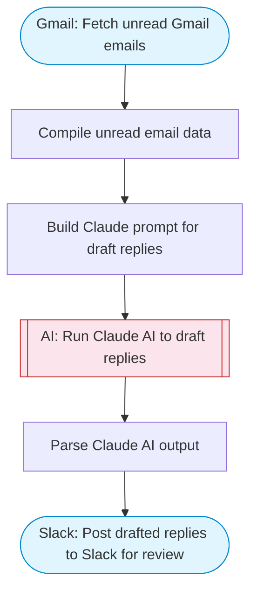

# Gmail AI Auto-Responder with Slack Review

Fetches unread Gmail emails, uses Claude AI to assess each email and draft contextually appropriate replies, then posts the drafted replies to Slack with Block Kit formatting for human review before sending.

> **Works with any AI agent.** Paste this page's URL into Claude Code, Codex, Cursor, Windsurf, OpenClaw, or any coding agent — it will read the docs, connect your platforms, and run this flow for you.

## Quick Start

```bash
# 1. Connect your platforms (one-time setup)
one add gmail
one add slack

# 2. Run the flow
one flow execute n8n-2271-gmail-auto-responder \
  --input slackChannel="C01ABC123" \
  --input senderName="Alex" \
  --input replyTone="..." \
  --input maxEmails="user@example.com"
```

## Platforms

| Platform | Used for |
|----------|----------|
| Gmail | Reading unread emails |
| Slack | Posting draft review |

> Don't have these connected yet? Run `one list` to check, then `one add <platform>` to connect.

## What it does

1. Fetch unread Gmail emails
2. Compile unread email data
3. Build Claude prompt for draft replies
4. Run Claude AI to draft replies
5. Parse Claude AI output
6. Post drafted replies to Slack for review

## Flow diagram



## Inputs

| Input | Required | Description |
|-------|----------|-------------|
| `slackChannel` | Yes | Slack channel to post drafted replies for review |
| `senderName` | No | Your name to use in reply signatures (default: AI Assistant) |
| `replyTone` | No | Tone for replies: professional, friendly, formal, casual (default: professional) |
| `maxEmails` | No | Maximum number of unread emails to process (default: 15) |

---

<sub>Based on [n8n #2271](https://n8n.io/workflows/2271) · 72.9K views on n8n · by [nchourrout](https://n8n.io/creators/nchourrout) · Converted to One CLI on 2026-03-25</sub>
