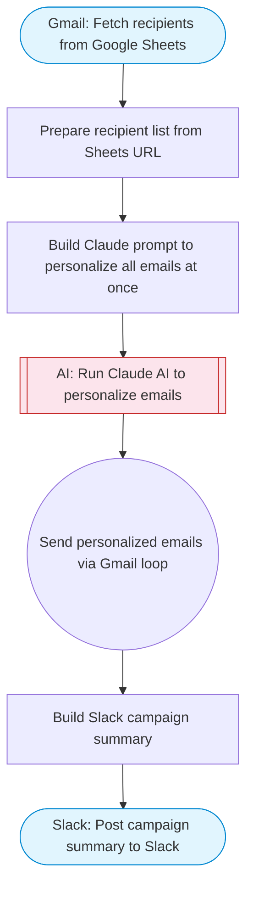

# Gmail campaign sender: bulk personalized emails from Sheets

Reads recipient data from Google Sheets, uses Claude AI to personalize each email based on recipient details, then sends individualized emails via Gmail in a loop. Tracks send status back to Sheets.

> **Works with any AI agent.** Paste this page's URL into Claude Code, Codex, Cursor, Windsurf, OpenClaw, or any coding agent — it will read the docs, connect your platforms, and run this flow for you.

## Quick Start

```bash
# 1. Connect your platforms (one-time setup)
one add google-sheets
one add gmail
one add slack

# 2. Run the flow
one flow execute n8n-2137-gmail-campaign-sender \
  --input slackChannel="C01ABC123" \
  --input spreadsheetUrl="https://example.com" \
  --input sheetName="..." \
  --input campaignSubject="..." \
  --input campaignContext="..." \
  --input senderName="Alex"
```

## Platforms

| Platform | Used for |
|----------|----------|
| Google Sheets | Reading recipients |
| Gmail | Sending emails |
| Slack | Campaign status notifications |

> Don't have these connected yet? Run `one list` to check, then `one add <platform>` to connect.

## What it does

1. Fetch recipients from Google Sheets
2. Prepare recipient list from Sheets URL
3. Build Claude prompt to personalize all emails at once
4. Run Claude AI to personalize emails
5. Send personalized emails via Gmail loop
6. Build Slack campaign summary
7. Post campaign summary to Slack

## Flow diagram



## Inputs

| Input | Required | Description |
|-------|----------|-------------|
| `slackChannel` | Yes | Slack channel ID for campaign notifications |
| `spreadsheetUrl` | Yes | Google Sheets URL containing recipients (columns: Name, Email, Company, Role, Notes) |
| `sheetName` | No | Name of the sheet tab with recipient data (default: Sheet1) |
| `campaignSubject` | Yes | Email subject line template (use {name} and {company} as placeholders) |
| `campaignContext` | Yes | Brief description of what the campaign is about (e.g. 'We offer AI automation services for mid-market SaaS companies') |
| `senderName` | No | Name to use in email signature (default: Your Name) |

---

<sub>Based on [n8n #2137](https://n8n.io/workflows/2137) · 58.3K views on n8n · by [davidn8n](https://n8n.io/creators/davidn8n) · Converted to One CLI on 2026-03-25</sub>
