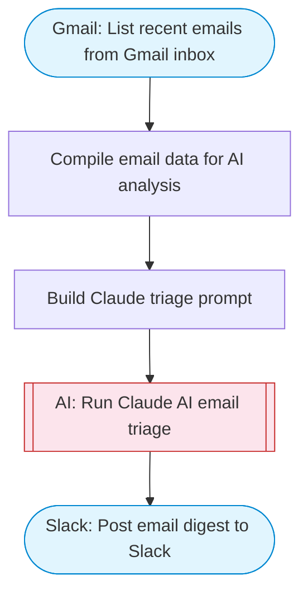

# Gmail AI email manager

Fetches recent emails from Gmail inbox, uses Claude AI to triage and categorize each email (to-respond, FYI, notification, marketing), drafts response suggestions for action-required emails, and posts a structured digest to Slack.

> **Works with any AI agent.** Paste this page's URL into Claude Code, Codex, Cursor, Windsurf, OpenClaw, or any coding agent — it will read the docs, connect your platforms, and run this flow for you.

## Quick Start

```bash
# 1. Connect your platforms (one-time setup)
one add gmail
one add gmail
one add slack

# 2. Run the flow
one flow execute n8n-8089-gmail-email-manager \
  --input slackChannel="C01ABC123" \
  --input maxEmails="user@example.com"
```

## Platforms

| Platform | Used for |
|----------|----------|
| Gmail | Listing emails |
| Gmail | Getting email details |
| Slack | Post email digest to Slack |

> Don't have these connected yet? Run `one list` to check, then `one add <platform>` to connect.

## What it does

1. List recent emails from Gmail inbox
2. Compile email data for AI analysis
3. Build Claude triage prompt
4. Run Claude AI email triage
5. Post email digest to Slack

## Flow diagram



## Inputs

| Input | Required | Description |
|-------|----------|-------------|
| `slackChannel` | Yes | Slack channel to post the email digest |
| `maxEmails` | No | Maximum number of recent emails to process (default: 10) |

---

<sub>Based on [n8n #8089](https://n8n.io/workflows/4722) · 93.7K views on n8n · Converted to One CLI on 2026-03-25</sub>
