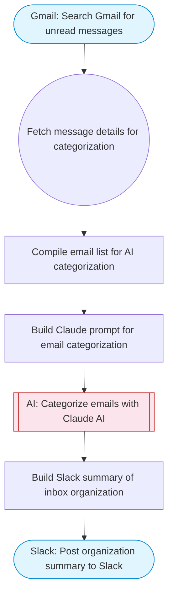

# Automate Gmail Inbox Organization with AI Categorization

Searches recent Gmail messages, uses Claude AI to categorize each email (Work, Shopping, Newsletter, Personal, etc.), applies Gmail labels based on category, and posts an organization summary to Slack.

> **Works with any AI agent.** Paste this page's URL into Claude Code, Codex, Cursor, Windsurf, OpenClaw, or any coding agent — it will read the docs, connect your platforms, and run this flow for you.

## Quick Start

```bash
# 1. Connect your platforms (one-time setup)
one add gmail
one add gmail
one add slack

# 2. Run the flow
one flow execute n8n-5518-gmail-inbox-organizer \
  --input searchQuery="your question here" \
  --input maxMessages="10" \
  --input slackChannel="C01ABC123"
```

## Platforms

| Platform | Used for |
|----------|----------|
| Gmail | Listing messages |
| Gmail | Modifying messages (labels) |
| Slack | Post organization summary to Slack |

> Don't have these connected yet? Run `one list` to check, then `one add <platform>` to connect.

## What it does

1. Search Gmail for unread messages
2. Fetch message details for categorization
3. Compile email list for AI categorization
4. Build Claude prompt for email categorization
5. Categorize emails with Claude AI
6. Post organization summary to Slack

## Flow diagram



## Inputs

| Input | Required | Description |
|-------|----------|-------------|
| `searchQuery` | No | Gmail search query for messages to organize (default: is:unread newer_than:1d) |
| `maxMessages` | No | Maximum messages to process (default: 20) |
| `slackChannel` | Yes | Slack channel for organization summary |

---

<sub>Based on [n8n #5518](https://n8n.io/workflows/5518) · 21.9K views on n8n · by [solidoai](https://n8n.io/creators/solidoai) · Converted to One CLI on 2026-03-25</sub>
